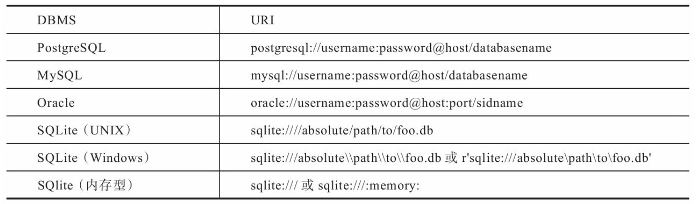
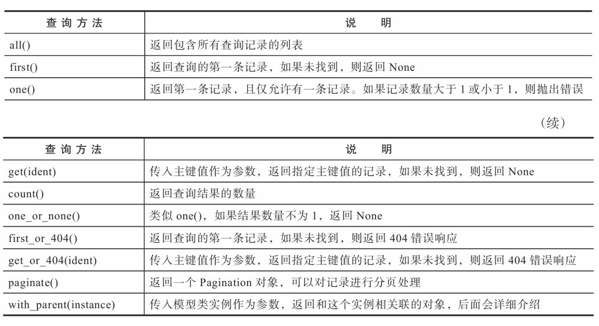
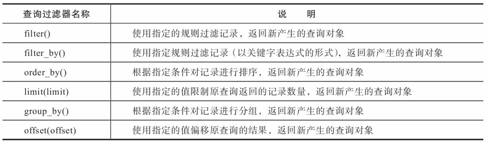
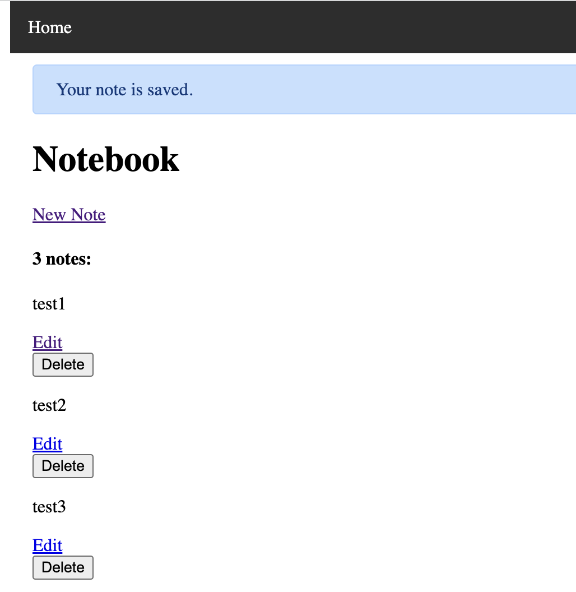
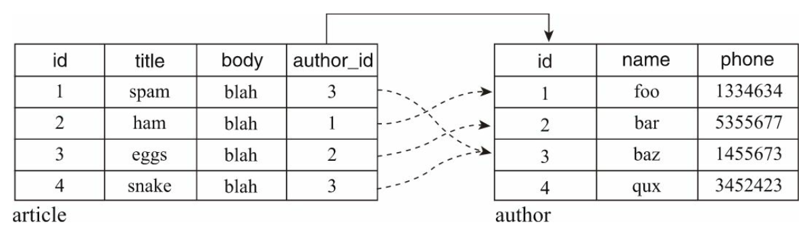

# 数据库
## ORM
ORM把底层的SQL数据实体转化成高层的Python对象，ORM主要实现了三层映射关系:
 * 表→Python类。
 * 字段(列)→类属性。
 * 记录(行)→类实例。

比如，我们要创建一个contacts表来存储留言，其中包含用户名称和电话号码两个字段。在SQL中，下面的代码用来创建这个表:
```
CREATE TABLE contacts(
       name varchar(100) NOT NULL,
       phone_number varchar(32),
);
```
如果使用ORM，我们可以使用类似下面的Python类来定义这个表:
```python
from foo_orm import Model, Column, String
class Contact(Model):
   __tablename__ = 'contacts'
   name = Column(String(100), nullable=False)
   phone_number = Column(String(32))
```
## 使用Flask-SQLAlchemy管理数据库
要连接数据库服务器，首先要为我们的程序指定数据库URI(Uniform Resource Identifier，统一资源标识符)。
数据库URI是一串包含各种属性的字符串，其中包含了各种用于连接数据库的信息。

在Flask-SQLAlchemy中，数据库的URI通过配置变量 SQLALCHEMY_DATABASE_URI设置，默认为SQLite内存型数据库 (sqlite:///:memory:)。
SQLite是基于文件的DBMS，不需要设置数据库服务器，只需要指定数据库文件的绝对路径。
我们使用app.root_path来定位数据库文件的路径，并将数据库文件命名为data.db。  
SQLite的数据库URI在Linux或macOS系统下的斜线数量是4个;在 Windows系统下的URI中的斜线数量为3个。内存型数据库的斜线固定为 3个。
```python
# SQLite URI compatible
WIN = sys.platform.startswith('win')
if WIN:
    prefix = 'sqlite:///'
else:
    prefix = 'sqlite:////'
app.config['SQLALCHEMY_DATABASE_URI'] = os.getenv('DATABASE_URL', prefix + os.path.join(app.root_path, 'data.db'))
```
### 定义数据库模型
```python
class Note(db.Model):
   id = db.Column(db.Integer, primary_key=True)
   body = db.Column(db.Text)
```
### 创建数据库和表
```
$ flask shell
>>> from app import db
>>> db.create_all()
```
我们也可以自己实现一个自定义flask命令完成这个工作
```python
import click
...
@app.cli.command()
def initdb():
  db.create_all()   
  click.echo('Initialized database.')
```
```
$ flask initdb
Initialized database.
```
## 数据库操作
### CRUD
#### Create
```
>>> from app import db, Note
>>> note1 = Note(body='remember Sammy Jankis')
>>> note2 = Note(body='SHAVE')
>>> note3 = Note(body='DON'T BELIEVE HIS LIES, HE IS THE ONE, KILL HIM')
>>> db.session.add(note1)
>>> db.session.add(note2)
>>> db.session.add(note3)
>>> db.session.commit()
```
#### Read
一般来说，一个完整的查询遵循下面的模式:  
```
<模型类>.query.<过滤方法>.<查询方法>
```
SQLAlchemy提供了许多查询方法用来获取记录:  

```
>>> note1 = Note.query.first()
>>> note1
<Note u'remember Sammy Jankis'>
>>> note1.body
u'remember Sammy Jankis'
```
SQLAlchemy还提供了许多过滤方法，使用这些过滤方法可以获取更精确的查询，比如获取指定字段值的记录。

```
>>> Note.query.filter(Note.body='SHAVE').first()
<Note u'SHAVE'>

>>> Note.query.filter_by(body='SHAVE').first()
<Note u'SHAVE'>
```
#### Update
更新一条记录非常简单，直接赋值给模型类的字段属性就可以改变字段值，然后调用commit()方法提交会话即可。
```
>>> note = Note.query.get(2)
>>> note.body
u'SHAVE'
>>> note.body = 'SHAVE LEFT THIGH'
>>> db.session.commit()
```
#### Delete
删除记录和添加记录很相似，不过要把add()方法换成delete() 方法，最后都需要调用commit()方法提交修改。
```
>>> note = Note.query.get(2)
>>> db.session.delete(note)
>>> db.session.commit()
```

### 在视图函数里操作数据库
#### Create
提交表单内容到数据库：
```python
@app.route('/new', methods=['GET', 'POST'])
   def new_note():
       form = NewNoteForm()
       if form.validate_on_submit():
           body = form.body.data
           note = Note(body=body)
           db.session.add(note)
           db.session.commit()
           flash('Your note is saved.')
           return redirect(url_for('index'))
       return render_template('new_note.html', form=form)
```
#### Read
当你在创建笔记页面单击保存后，程序会重定向到主页，提示的消息告诉你刚刚提交的笔记已经成功保存了，可是你却无法看到创建后的笔记。
为了在主页列出所有保存的笔记，我们需要修改index视图:
```python
@app.route('/')
def index():
   form = DeleteForm()
   notes = Note.query.all()
   return render_template('index.html', notes=notes, form=form)
```
在index.html中渲染数据：
```html
<h1>Notebook</h1>
<a href="{{ url_for('new_note') }}">New Note</a>
<h4>{{ notes|length }} notes:</h4>

   <div class="note">
       <p>{{ note.body }}</p>
   </div>

```

#### Update
编辑笔记表单：
```python
class EditNoteForm(FlaskForm):
   body = TextAreaField('Body', validators=[DataRequired()])
   submit = SubmitField('Update')
```
处理表单：
```python
@app.route('/edit/<int:note_id>', methods=['GET', 'POST'])
def edit_note(note_id):
   form = EditNoteForm()
   note = Note.query.get(note_id)
   if form.validate_on_submit():
       note.body = form.body.data
       db.session.commit()
       flash('Your note is updated.')
       return redirect(url_for('index'))
   form.body.data = note.body
   return render_template('edit_note.html', form=form)
```
#### Delete
```python
class DeleteNoteForm(FlaskForm):
   submit = SubmitField('Delete')

@app.route('/delete/<int:note_id>', methods=['POST'])
def delete_note(note_id):
   form = DeleteForm()
   if form.validate_on_submit():
        note = Note.query.get(note_id) # 获取对应记录 
        db.session.delete(note) # 删除记录 
        db.session.commit() # 提交修改
        flash('Your note is deleted.')
   else: 
        abort(400)
   return redirect(url_for('index'))
```
因为删除按钮要在主页的笔记内容下添加，我们需要在index视图 中实例化DeleteNote-Form类，然后传入模板。
```html

<div class="note">
   <p>{{ note.body }}</p>
   <a class='btn' href="{{ url_for('edit_note', note_id=note.id) }}">Edit</a>
   <form method="post" action="{{ url_for('delete_note', note_id=note.id) }}">
       {{ form.csrf_token }}
       {{ form.submit(class='btn') }}
   </form>
</div>

```


## 定义关系
在关系型数据库中，我们可以通过关系让不同表之间的字段建立联系。一般来说，定义关系需要两步，分别是创建外键和定义关系属性。  
### 配置Python Shell上下文
在上面的许多操作中，每一次使用flask shell命令启动Python Shell后都要从app模块里导入db对象和相应的模型类。
我们可以使用app.shell_context_processor装饰器注册一个shell上下文处理函数。
```python
@app.shell_context_processor
def make_shell_context():
    return dict(db=db, Note=Note) # 等同于{'db': db, 'Note': Note}
```
当使用flask shell命令启动Python Shell时，
所有使用 app.shell_context_processor装饰器注册的shell上下文处理函数都会被自动执行，
这会将db和Note对象推送到Python Shell上下文里:
```
$ flask shell
>>> db
<SQLAlchemy engine=sqlite:///Path/to/your/data.db>
>>> Note
<class 'app.Note'>
```
### 一对多
一个作者（Author）可以对应多篇文章（Article）。

```python
# one to many
class Author(db.Model):
    id = db.Column(db.Integer, primary_key=True)
    name = db.Column(db.String(20), unique=True)
    phone = db.Column(db.String(20))
    articles = db.relationship('Article')  # collection

    def __repr__(self):
        return '<Author %r>' % self.name


class Article(db.Model):
    id = db.Column(db.Integer, primary_key=True)
    title = db.Column(db.String(50), index=True)
    body = db.Column(db.Text)
    author_id = db.Column(db.Integer, db.ForeignKey('author.id'))

    def __repr__(self):
        return '<Article %r>' % self.title
```
relationship()函数的第一个参数 为关系另一侧的模型名称，它会告诉SQLAlchemy将Author类与Article类建立关系。
当这个关系属性被调用时，SQLAlchemy会找到关系另一侧 (即article表)的外键字段(即author_id)，
然后反向查询article表中所有author_id值为当前表主键值(即author.id)的记录，返回包含这些记录的列表，
也就是返回某个作者对应的多篇文章记录。  
除了给对象直接赋值外，
通过操作关系属性，将关系属性赋给实际的对象即可建立关系。集合关系属性可以像列表一样操作，调用append()方法来与一个Article对象建立关系:
```
>>> foo = Author(name='Foo')
>>> spam = Article(title='Spam')
>>> ham = Article(title='Ham')
>>> db.session.add(foo)
>>> db.session.add(spam)
>>> db.session.add(ham)
>>> foo.articles.append(spam)
>>> foo.articles.append(ham)
>>> db.session.commit()
```
和append()相对，对关系属性调用remove()方法可以与对应的Aritcle对象解除关系。

## 更新数据库表
### 重新生成表
如果你并不在意表中的数据，最简单的方法是使用drop_all()方法删除表以及其中的数据，然后再使用create_all()方法重新创建:
```
>>> db.drop_all()
>>> db.create_all()
```
为了方便开发，我们修改initdb命令函数的内容，为其增加一个--drop选项来支持删除表和数据库后进行重建:
```python
@app.cli.command()
@click.option('--drop', is_flag=True, help='Create after drop.')
def initdb(drop):
   """Initialize the database."""
   if drop:
       click.confirm('This operation will delete the database, do you want to continue?'
       db.drop_all()
       click.echo('Drop tables.')
   db.create_all()
   click.echo('Initialized database.')
```
现在，执行下面的命令会重建数据库和表:
```
$ flask initdb --drop
```
### 使用Flask-Migrate迁移数据库
扩展Flask-Migrate集成了Alembic，提供了一些flask命令来简化迁移工作，我们将使用它来迁移数据库。
