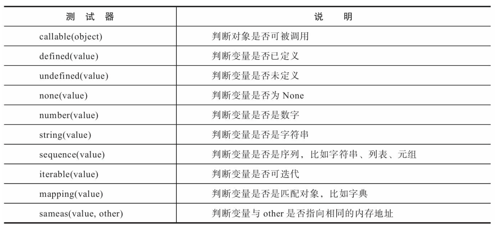

# Flask Note 
2022/5/2 
Start learning Flask :)

# 安装
pipenv: 基于pip的Python包管理工具  
安装pipenv：
```
pip install pipenv  
```
新建虚拟环境：  
```
pipenv install
```
在当前工作目录创建虚拟环境, 还会在当前目录下创建Pipfile, Pipfile.lock文件，前者记录依赖包列表，后者记录固定版本的详细依赖包列表。当我们使用pipenv更新/创建/删除依赖包时，这两个文件会自动更新。这种方式代替了传统的pip+requirements.txt方式，requirements.txt需要手动维护。

激活虚拟环境:
```
pipenv shell
```


安装flask:  
```
pipenv install flask  
```

更新flask:
```
pipenv update flask  
```

# 最小的flask app
```python
from flask import Flask

app = Flask(__name__)
# Flask第一个参数是模块或包名，使用__name__的话，python会根据所处的模块命名，如当前程序在app.py，那么这个值为app


# the minimal Flask application
@app.route('/')
def index():
    return '<h1>Hello, World!</h1>'
```

## 客户端与服务器上的flask程序交互步骤
1. 用户输入URL访问某个资源
2. Flask收到请求并分析URL
3. 为这个URL找到处理函数
4. 执行函数并生成响应，返回给浏览器
5. 浏览器接收并解析响应，在页面上显示信息

@app.route() 装饰器根据传入的URL规则，与处理函数建立联系。这个过程称为“注册路由”(route)，这个函数称为“视图函数”(view function)。  
URL规则是字符串，以斜杠开始，是相对URL，不包含域名。

## 一个视图可以绑定多个URL
```python
# bind multiple URL for one view function
@app.route('/hi')
@app.route('/hello')
def say_hello():
    return '<h1>Hello, Flask!</h1>'
```
## 动态URL
URL规则中可以添加变量，Flask会把变量传入视图函数。
```python
# dynamic route, URL variable default
@app.route('/greet', defaults={'name': 'Programmer'})
@app.route('/greet/<name>')
def greet(name):
    return '<h1>Hello, %s!</h1>' % name
```
当URL规则包含变量，但用户没有添加变量时，那么Flask会在匹配失败时返回404错误响应。为避免这种情况，可以为变量添加一个默认值，为视图添加一个新的装饰器处理没有传参的情况。
```python
@app.route('/greet')
@app.route('/greet/<name>')
def greet(name='Programmer'):
return '<h1>Hello, %s!</h1>' % name
```
# 启动Flask

flask run命令默认监听 127.0.0.1:5000 地址。  
  
使用flask run命令前，需要提供程序所在位置，flask会自动从两个位置寻找：  
 - 当前目录下寻找app.py和wsgy.py，并从中寻找app或application对象
 - 从环境变量FLASK_APP对应的值寻找名为app或application的程序实例  

当前使用的app对象就在app.py，所以flask通过第一种方法能探测到；如果我们使用的是别的名字，如hello.py，那就需要在环境变量设置FLASK_APP。  
Linux:
```bash
$ export FLASK_APP=hello
```
Windows:
```
> set FLASK_APP=hello
```

为了避免每次重启都需要重新设置FLASK_APP环境变量，或者在开发多个Flask程序需要切换环境变量，可以使用pythondotenv
管理项目的环境变量。  
```
pipenv install python-dotenv
```
在项目根目录创建两个文件，.env和.flaskenv。  
.env: 存储敏感信息环境变量，如email账户密码。  
.flaskenv：存储公共环境变量，如FLASK_APP。

Flask加载环境变量的优先级：  
手动设置的环境变量>.env中设置的环境变量>.flaskenv设置的环境变量

## 设置运行环境
为了区分production和development环境，Flask提供了一个FLASK_ENV环境变量，默认为production。  
在开发时，可以在.flaskenv文件中将它设置为development。
```
FLASK_ENV=development
```
开发模式下，调试模式（Debug Mode）将被开启，这时执行flask run启动程序会自动激活Werkzeug内置的调试器（debugger）和重载器 （reloader）。  
调试器非常强大，当程序出错时，我们可以在网页上看到详细的错误追踪信息。  
重载器的作用就是监测文件变动，然后重新启动开发服务器。  
默认会使用Werkzeug内置的stat重载器，它的缺点是耗电较严重，而且准确性一般。
为了获得更优秀的体验，我们可以安装另一个用于监测文件变动的Python库Watchdog：
```bash
$ pipenv install watchdog --dev
```
-dev声明了这个包只在开发时被用到。

## 使用flask shell启动Python Shell
```
D:\workspace\helloflask\demos\hello> flask shell
Python 3.8.2 (tags/v3.8.2:7b3ab59, Feb 25 2020, 22:45:29) [MSC v.1916 32 bit (Intel)] on win32
App: app [development]
Instance: D:\workspace\helloflask\demos\hello\instance
>>>
```

## 自定义flask命令
除了flask run, flask shell等命令外，还可以在app.py中通过函数创建flask命令。  
```python
# custom flask cli command
@app.cli.command()
def hello():
    """Just say hello."""
    click.echo('Hello, Human!')
```
函数的名称即为命令名称，通过flask hello来触发函数。
```
D:\workspace\helloflask\demos\hello> flask hello
Hello, Human!
```

# Flask & HTTP
## Request 对象
请求URL和报文中的其他信息都可以通过Flask的Request对象提供的属性和方法获取。
URL: http://helloflask.com/hello?name=Grey
  
```python
from flask import Flask, request
app = Flask(__name__)
@app.route('/hello')
def hello():
    name = request.args.get('name', 'Flask')  # 通过request对象得到传入的name，若未传入，默认值为Flask
    # 使用request.args.get而不是args['name']的原因是
    # 如果args中没有name这个key，那么会返回HTTP 400错误响应(Bad Request，表示请求无效)，而不是抛出KeyError异常
    # 为了避免这个错误，应该使用get方法
    return '<h1>Hello, %s!<h1>' % name
```
## Flask 处理请求
当前运行的app实例会存储一张路由表(app.url_map)，其中定义了URL规则和视图函数的映射关系。
当请求发来后，Flask会根据请求报文中的URL(path部分)来尝试与这个表中的所有URL规则进行匹配，调用匹配成功的视图函数。
如果没有找到匹配的URL规则，说明程序中没有处理这个URL的视图函数，Flask会自动返回404错误响应(Not Found，表示资源未找到)。  

使用flask routes命令可以查看程序中定义的所有路由，这个列表由app.url_map解析得到：  
```
$ flask routes
Endpoint  Methods  Rule
--------  -------  -----------------------
hello     GET
go_back   GET
hi        GET
...
static GET
/hello
/goback/<int:age>
/hi
/static/<path:filename>
```

### 设置监听的HTTP方法
在app.route()装饰器的methods参数可以设置监听方法：  
```python
@app.route('/hello', methods=['GET', 'POST'])
def hello():
   return '<h1>Hello, Flask!</h1>'
```
如果使用了不被允许的监听方法，访问该URL时视图函数会返回405错误响应（Method Not Allowed，表示请求方法不允许）。  

### URL处理
app.route()装饰器中可以对传入的变量进行类型转化，当变量无法转化时，会返回404错误响应，间接验证了传入变量类型是否正确。  
 
```python
@app.route('goback/<int:year>')
def go_back(year):
   return '<p>Welcome to %d!</p>' % (2018 - year)
```
any 提供了一个可选的value列表：  
```python
@app.route('/colors/<any(blue, white, red):color>')
def three_colors(color):
    ...
```
可以使用格式化字符串的方式来设置这个列表，用%s或format都可以：  
```python
colors = ['blue', 'white', 'red']
@app.route('/colors/<any(%s):color>' % str(colors)[1:-1])
...
```
### 请求钩子
请求钩子用于预处理、后处理。  
 

```python
@app.before_request
def do_something():
    pass # 这里的代码会在每个请求处理前执行
```
常见的应用是建立数据库连接，通常会有多个视图函数需要建立和关闭数据库连接，这些操作基本相同。
一个理想的解决方法是在 请求之前(before_request)建立连接，在请求之后(teardown_request) 关闭连接。  

## HTTP 响应
响应报文主要由协议版本、状态码(status code)、原因短语 (reason phrase)、响应首部和响应主体组成。
以发向localhost: 5000/hello的请求为例：  
 

响应报文的首部包含一些关于响应和服务器的信息，这些内容由Flask生成，而我们在视图函数中返回的内容即为响应报文中的主体内容。
浏览器接收到响应后，会把返回的响应主体解析并显示在浏览器窗口上。
常见的HTTP状态码：  
 

### 在Flask中生成响应
Flask会先判断是否可以找到与请求URL相匹配的路由，如果没有则返回404响应。
如果找到，则调用对应的视图函数，视图函数的返回值构成了响应报文的主体内容，正确返回时状态码默认为200。
Flask会调用make_response()方法将视图函数返回值转换为响应对象。  
视图函数可以返回最多由三个元素组成的元组:响应主体、状态码、首部字段。其中首部字段可以为字典，或是两元素元组组成的列表。  

只包含主体的响应：  
```python
@app.route('/hello')
def hello():
    ...
    return '<h1>Hello, Flask!</h1>'
```
默认状态码为200，可以指定：  
```python
@app.route('/hello')
def hello():
    ...
    return '<h1>Hello, Flask!</h1>', 201
```
有时你会想附加或修改某个首部字段。比如，要生成状态码为3XX的重定向响应，需要将首部中的Location字段设置为重定向的目标URL:
```python
@app.route('/hello')
def hello():
    ...
    return '', 302, {'Location', 'http://www.example.com'}
```
也可以通过使用Flask提供的redirect()函数来生成重定向响应：
```python
from flask import Flask, redirect
# ...
@app.route('/hello')
def hello():
    return redirect('http://www.example.com')
```
如果要在程序内重定向到其他视图，那么只需在redirect()函数中使用url_for()函数生成目标URL即可:
```python
from flask import Flask, redirect, url_for
...
@app.route('/hi')
def hi():
    ...
    return redierct(url_for('hello'))

@app.route('/hello')
def hello():
```
在abort()函数中传入状态码即可返回对应的错误响应:  
```python
from flask import Flask, abort
...
@app.route('/404')
def not_found():
    abort(404)
```

### 响应格式
MIME类型(又称为media type或content type)是一种用来标识文件类型的机制，比如，HTML的MIME类型为“text/html”，png图片的MIME类型为“image/png”。
默认的响应格式是HTML，如果你想使用其他MIME类型，可以通过Flask提供的make_response()方法生成响应对象，传入响应的主体作为参数，
然后使用响应对象的mimetype属性设置MIME类型，比如:
```python
from flask import make_response
@app.route('/foo')
def foo():
   response = make_response('Hello, World!')
   response.mimetype = 'text/plain'
   return response
```

### Cookie
Cookie指Web服务器为了存储某些数据(比如用户信息)而保存在浏览器上的小型文本数据。
浏览器会在一定时间内保存它，并在下一次向同一个服务器发送请求时附带这些数据。
Cookie通常被用来进行用户会话管理(比如登录状态)，保存用户的个性化信息(比如语言偏好， 
视频上次播放的位置，网站主题选项等)以及记录和收集用户浏览数据 以用来分析用户行为等。  

在Flask中，如果想要在响应中添加一个cookie，最方便的方法是使用Response类提供的set_cookie()方法。
要使用这个方法，我们需要先使用make_response()方法手动生成一个响应对象，传入响应主体作为参数。这个响应对象默认实例化内置的Response类。  

set_cookie()方法支持多个参数来设置Cookie的选项:

将name变量设置到名为name的cookie中：
```python
from flask import Flask, make_response
...
@app.route('/set/<name>')
def set_cookie(name):
   response = make_response(redirect(url_for('hello')))
   response.set_cookie('name', name)
   return response
```
set_cookie视图会在生成的响应报文首部中创 建一个Set-Cookie字段，即“Set-Cookie:name=Grey;Path=/”。  
在Flask中，Cookie可以通过请求对象的cookies属性读取。在修改后的hello视图中，如果没有从查询参数中获取到name的值，就从Cookie中寻找:
```python
from flask import Flask, request
@app.route('/')
@app.route('/hello')
def hello():
   name = request.args.get('name')
   if name is None:
      name = request.cookies.get('name', 'Human') # 从Cookie中获取name值 
   return '<h1>Hello, %s</h1>' % name
```

### session
如果直接把认证信息以明文的方式存储在Cookie里，那么恶意用户就可以通过伪造cookie的 内容来获得对网站的权限，冒用别人的账户。
为了避免这个问题，我们需要对敏感的Cookie内容进行加密。
在Flask中，session对象用来加密Cookie。默认情况下，它会把数据存储在浏览器上一个名为session的cookie里。  

#### 设置密钥
session通过密钥对数据进行签名以加密数据。  
程序的密钥可以通过Flask.secret_key属性或配置变量SECRET_KEY设置，比如：
```python
app.secret_key = 'secret string'
```
更安全的做法是把密钥写进系统环境变量（在命令行中使用export或set命令），或是保存在.env文件中：
```text
SECRET_KEY=secret string
```
然后在程序脚本中使用os模块提供的getenv（）方法获取：
```python
import os
# ...
app.secret_key = os.getenv('SECRET_KEY', 'secret string')
```
我们可以在getenv（）方法中添加第二个参数，作为没有获取到对应环境变量时使用的默认值。
这里的密钥只是示例。在生产环境中，为了安全考虑，你必须使用随机生成的密钥。
#### 模拟用户认证
```python
from flask import redirect, session, url_for
@app.route('/login')
def login():
    session['logged_in'] = True # 写入session
    return redirect(url_for('hello'))
```
用户登入，当我们使用session对象添加cookie时，数据会使用程序的密钥对其进行签名，加密后的数据存储在一块名为session的cookie里。  
当支持用户登录后，我们就可以根据用户的认证状态分别显示不同的内容。在login视图的最后，我们将程序重定向到hello视图.
```python
from flask import request, session
@app.route('/')
@app.route('/hello')
def hello():
    name = request.args.get('name')
    if name is None:
    name = request.cookies.get('name', 'Human')
    response = '<h1>Hello, %s!</h1>' % name
    # 根据用户认证状态返回不同的内容
    if 'logged_in' in session:
        response += '[Authenticated]'
    else:
        response += '[Not Authenticated]'
    return response
```
session中的数据可以像字典一样通过键读取，或是使用get（）方法。  
这里我们只是判断session中是否包含logged_in键，如果有则表示用户已经登录。通过判断用户的认证状态，我们在返回的响应中添加一行表示认证状态的信息：
如果用户已经登录，显示[Authenticated]；否则显示[Not authenticated]。  
程序中的某些资源仅提供给登入的用户，比如管理后台，这时我们就可以通过判断session是否存在logged-in键来判断用户是否认证，比如admin视图：
```python
from flask import session, abort
@app.route('/admin')
def admin():
    if 'logged_in' not in session:
        abort(403)
    return 'Welcome to admin page.'
```
通过判断logged_in是否在session中，我们可以实现：如果用户已经认证，会返回一行提示文字，否则会返回403错误响应。  
登出用户的logout视图也非常简单，登出账户对应的实际操作其实就是把代表用户认证的logged-in cookie删除，这通过session对象的pop方法实现:
```python
from flask import session
@app.route('/logout')
def logout():
    if 'logged_in' in session:
        session.pop('logged_in')
    return redirect(url_for('hello'))
```
默认情况下，session cookie会在用户关闭浏览器时删除。  
尽管session对象会对Cookie进行签名并加密，但这种方式仅能够确保session的内容不会被篡改，加密后的数据借助工具仍然可以轻易读取（即使不知道密钥）。
因此，绝对不能在session中存储敏感信息，比如用户密码。  

## Flask上下文
Flask中有两种上下文，程序上下文(application context)和请求上下文(request context)。  
为了方便获取这两种上下文环境中存储的信息，Flask提供了四个上下文全局变量。
 - current_app: 指向处理请求的当前程序实例。
 - g: 替代Python的全局对象用法、确保仅在当前请求中可用。用于存储全局数据，每次请求都会重设。
 - request：封装客户端发出的请求报文数据。
 - session：用于记住请求之间的数据，通过签名的Cookie实现。


在前面的示例中，我们并没有传递这个参数，而是直接从Flask导入一个全局的request对象，
然后在视图函数里直接调用request的属性获取数据。
你一定好奇，我们在全局导入时request只是一个普通的Python对象，为什么在处理请求时，
视图函数里的request就会自动包含对应请求的数据?
这是因为Flask会在每个请求产生后自动激活当前请求的上下文，激活请求上下文后，request被临时设为全局可访问。
而当每个请求结束后，Flask就销毁对应的请求上下文。  

在多线程服务器中，在同一时间可能会有多个请求在处理。
假设有三个客户端同时向服务器发送请求，这时每个请求都有各自不同的请求报文，所以请求对象也必然是不同的。
因此，请求对象只在各自的线程内是全局的。Flask通过本地线程(thread local)技术将请求对象在特定 的线程和请求中全局可访问。  

在不同的视图函数中，request对象都表示和视图函数对应的请求，也就是当前请求(current request)。
而程序也会有多个程序实例的情况，为了能获取对应的程序实例，而不是固定的某一个程序实例，我们就需要使用current_app变量。

因为g存储在程序上下文中，而程序上下文会随着每一个请求的进入而激活，随着每一个请求的处理完毕而销毁，所以每次请求都会重设这个值。
我们通常会使用它结合请求钩子来保存每个请求处理前所需要的全局变量，比如当前登入的用户对象，数据库连接等。
在前面的示例中，我们在hello视图中从查询字符串获取name的值，如果每一个视图都需要这个值，那么就要在每个视图重复这行代码。
借助g我们可以将这个操作移动到before_request处理函数中执行，然后保存到g的任意属性上:
```python
from flask import g
@app.before_request
def get_name():
   g.name = request.args.get('name')
```
设置这个函数后，在其他视图中可以直接使用g.name获取对应的值。
另外，g也支持使用类似字典的get()、pop()以及setdefault() 方法进行操作。

### 激活上下文
在下面这些情况下，Flask会自动帮我们激活程序上下文:
 - 当我们使用flask run命令启动程序时。 
 - 使用旧的app.run()方法启动程序时。 
 - 执行使用@app.cli.command()装饰器注册的flask命令时。 
 - 使用flask shell命令启动Python Shell时。

当请求进入时，Flask会自动激活请求上下文，这时我们可以使用request和session变量。
另外，当请求上下文被激活时，程序上下文也被自动激活。
当请求处理完毕后，请求上下文和程序上下文也会自动销毁。也就是说，在请求处理时这两者拥有相同的生命周期。

### 上下文钩子
Flask也为上下文提供了一个teardown_appcontext钩子，使用它注册的回调函数会在程序上下文被销毁时调用，
而且通常也会在请求上下文被销毁时调用。比如，你需要在每个请求处理结束后销毁数据库连接:
```python
@app.teardown_appcontext
def teardown_db(exception):
   ...
   db.close()
```

## HTTP进阶实践
### 重定向回上一个页面
在前面的示例程序中，我们使用redirect()函数生成重定向响应。 比如，在login视图中，登入用户后我们将用户重定向到/hello页面。
在复杂的应用场景下，我们需要在用户访问某个URL后重定向到上一个页面。
最常见的情况是，用户单击某个需要登录才能访问的链接，这时程序会重定向到登录页面，
当用户登录后合理的行为是重定向到用户登录前浏览的页面，以便用户执行未完成的操作，而不是直接重定向到主页。
```python
# redirect to last page
@app.route('/foo')
def foo():
    return '<h1>Foo page</h1><a href="%s">Do something and redirect</a>' \
           % url_for('do_something')


@app.route('/bar')
def bar():
    return '<h1>Bar page</h1><a href="%s">Do something and redirect</a>' \
           % url_for('do_something')
```
在这两个页面中，我们都添加了一个指向do_something视图的链接。
```python
@app.route('/do_something')
def do_something():
   # do something
   return redirect(url_for('hello'))
```
我们希望这个视图在执行完相关操作后能够重定向回上一个页面，而不是固定的/hello页面。
也就是说，如果在Foo页面上单击链接，我们希望被重定向回Foo页面;如果在Bar页面上单击链接，我们则希望返回到Bar页面。

1. 获取上一个页面的URL
要重定向回上一个页面，最关键的是获取上一个页面的URL。上一个页面的URL一般可以通过两种方式获取:  
#### HTTP referer
HTTP referer(起源为referrer在HTTP规范中的错误拼写)是一个用 来记录请求发源地址的HTTP首部字段(HTTP_REFERER)，即访问来源。
当用户在某个站点单击链接，浏览器向新链接所在的服务器发起请求，请求的数据中包含的HTTP_REFERER字段记录了用户所在的原站点URL。
这个值通常会用来追踪用户，比如记录用户进入程序的外部站点， 以此来更有针对性地进行营销。
在Flask中，referer的值可以通过请求对象的referrer属性获取，即request.referrer(正确拼写形式)。  
现在，do_something视图的返回值可以这样编写:
```python
return redirect(request.referrer)
```
但是在很多种情况下，referrer字段会是空值，比如用户在浏览器的地址栏输入URL，
或是用户出于保护隐私的考虑使用了防火墙软件或使用浏览器设置自动清除或修改了referrer字段。
我们需要添加一个备选项:
```python
return redirect(request.referrer or url_for('hello'))
```
#### 查询参数
另一种更常见的方式是在URL中手动加入包含当前页面URL的查询参数，这个查询参数一般命名为next。
下面在foo和bar视图的返回值中的URL后添加next参数：
```python
# redirect to last page
@app.route('/foo')
def foo():
    return '<h1>Foo page</h1><a href="%s">Do something and redirect</a>' \
           % url_for('do_something', next=request.full_path)


@app.route('/bar')
def bar():
    return '<h1>Bar page</h1><a href="%s">Do something and redirect</a>' \
           % url_for('do_something', next=request.full_path)
```
这里使用request.full_path获取当前页面的完整路径。在do_something视图中，我们获取这个next值，然后重定向到对应的路径:
```python
return redirect(request.args.get('next', url_for('hello')))
```
为了覆盖更全面，我们可以将这两种方式搭配起来一起使用:首先获取next参数，如果为空就尝试获取referer，如果仍然为空，
那么就重定向到默认的hello视图。因为在不同视图执行这部分操作的代码完全相同，我们可以创建一个通用的redirect_back()函数:
```python
def redirect_back(default='hello', **kwargs):
    for target in request.args.get('next'), request.referrer:
        if not target:
            continue
    return redirect(url_for(default, **kwargs))
```
通过设置默认值，我们可以在referer和next为空的情况下重定向到默认的视图。在do_something视图中使用这个函数的示例如下所示:
```python
@app.route('/do_something_and_redirect')
def do_something():
   # do something
   return redirect_back()
```
2. 对URL进行安全验证
确保URL安全的关键就是判断URL是否属于程序内部，我们创建了一个URL验证函数is_safe_url()，用来验证next变量值是否属于程序内部URL。
```python
from urlparse import urlparse, urljoin # Python3需要从urllib.parse导入 from flask import request
def is_safe_url(target):
   ref_url = urlparse(request.host_url)
   test_url = urlparse(urljoin(request.host_url, target))
   return test_url.scheme in ('http', 'https') and \
          ref_url.netloc == test_url.netloc
```
这个函数接收目标URL作为参数，并通过request.host_url获取程序内的主机URL，然后使用urljoin()函数将目标URL转换为绝对URL。 
接着，分别使用urlparse模块提供的urlparse()函数解析两个URL，最后对目标URL的URL模式和主机地址进行验证，
确保只有属于程序内部的URL才会被返回。在执行重定向回上一个页面的redirect_back()函 数中，我们使用is_safe_url()验证next和referer的值:
```python
def redirect_back(default='hello', **kwargs):
   for target in request.args.get('next'), request.referrer:
       if not target:
           continue
       if is_safe_url(target):
           return redirect(target)
   return redirect(url_for(default, **kwargs))
```

### 使用AJAX技术发送异步请求
AJAX指异步Javascript和XML(Asynchronous JavaScript And XML)，它不是编程语言或通信协议，而是一系列技术的组合体。
简单来说，AJAX基于XMLHttpRequest让我们可以在不重载页面的情况下和服务器进行数据交换。
加上JavaScript和DOM(Document Object Model，文档对象模型)，我们就可以在接收到响应数据后局部更新页面。
而XML指的则是数据的交互格式，也可以是纯文本(Plain Text)、HTML或JSON。  
jQuery是流行的JavaScript库，它包装了JavaScript，让我们通过更简单的方式编写JavaScript代码。
对于AJAX，它提供了多个相关的方法，使用它可以很方便地实现AJAX操作。  
对于处理AJAX请求的视图函数来说，我们不会返回完整的HTML响应，这时一般会返回局部数据，常见的三种类型如下所示:
1. 纯文本或局部HTML模板
纯文本可以在JavaScript用来直接替换页面中的文本值，而局部HTML则可以直接到插入页面中，比如返回评论列表:
```python
@app.route('/comments/<int:post_id>')
def get_comments(post_id):
   ...
   return render_template('comments.html')
```
2. JSON数据
```python
@app.route('/profile/<int:user_id>')
def get_profile(user_id):
   ...
   return jsonify(username=username, bio=bio)
```
3. 空值
```python
@app.route('/post/delete/<int:post_id>', methods=['DELETE'])
def delete_post(post_id):
   ...
   return '', 204
```
4. 异步加载长文章
在示例程序的对应页面中，我们将显示一篇很长的虚拟文章，文章正文下方有一个“加载更多”按钮，当加载按钮被单击时， 
会发送一个AJAX请求获取文章的更多内容并直接动态插入到文章下方。
```python
from jinja2.utils import generate_lorem_ipsum
@app.route('/post')
def show_post():
    post_body = generate_lorem_ipsum(n=2)
# 生成两段随机文本
    return '''
    <h1>A very long post</h1>
    <div class="body">%s</div>
    <button id="load">Load More</button>
    <script src="https://code.jquery.com/jquery-3.3.1.min.js"></script>
    <script type="text/javascript">
    $(function() {
    }) })
    $('#load').click(function() {
        $.ajax({
            url: '/more',
            type: 'get',
            success: function(data){
    // 目标URL
    // 请求方法
    // 返回2XX响应后触发的回调函数
    } })
    </script>''' % post_body
```

### HTTP服务器端推送  HTTP Server Push
#### 传统轮询
在特定的时间间隔内，客户端使用AJAX技术不断向服务端发起HTTP请求，然后获取新的数据并更新页面。
#### 长轮询
如果服务端没有新数据，则等待到有数据时才返回，取回数据后在此发送另一个请求。
#### Server-Sent Events 
在客户端和服务端建立一个通道，客户端监听来自服务端的数据，而服务端可以在任意时间发送数据。

# 模版
当用户访问程序的根地址时，我们的视图函数会向客户端返回一行HTML代码。然而，一个完整的HTML页面往往需要几十 行甚至上百行代码，
如果都写到视图函数里，那可真是个噩梦。
这样的代码既不简洁也难于维护，正确的做法是把HTML代码存储在单独的文件中，以便让程序的业务逻辑和表现逻辑分离，即控制器和用户界面的分离。  

在动态Web程序中，视图函数返回的HTML数据往往需要根据相应的变量(比如查询参数)动态生成。
当HTML代码保存到单独的文件中时，我们没法再使用字符串格式化或拼接字符串的方式来在HTML代码中插入变量，
这时我们需要使用模板引擎(template engine)。借助模板引擎，我们可以在HTML文件中使用特殊的语法来标记出变量，
这类包含固定内容和动态部分的可重用文件称为模板(template)。  

模板引擎的作用就是读取并执行模板中的特殊语法标记，并根据传入的数据将变量替换为实际值，输出最终的HTML页面，
这个过程被称为渲染(rendering)。Flask默认使用的模板引擎是Jinja2，它是一个功能齐全的Python模板引擎，除了设置变量，
还允许我们在模板中添加if判断，执行for迭代，调用函数等，以各种方式控制模板的输出。
对于Jinja2来说，模板可以是任何格式的纯文本文件，比如HTML、XML、 CSV、LaTeX等。

## 模版的基本使用
### 创建模版
电影虚拟数据：
```python
   user = {
       'username': 'Grey Li',
       'bio': 'A boy who loves movies and music.',
}
   movies = [
       {'name': 'My Neighbor Totoro', 'year': '1988'},
       {'name': 'Three Colours trilogy', 'year': '1993'},
       {'name': 'Forrest Gump', 'year': '1994'},
       {'name': 'Perfect Blue', 'year': '1997'},
       {'name': 'The Matrix', 'year': '1999'},
       {'name': 'Memento', 'year': '2000'},
       {'name': 'The Bucket list', 'year': '2007'},
       {'name': 'Black Swan', 'year': '2010'},
       {'name': 'Gone Girl', 'year': '2014'},
       {'name': 'CoCo', 'year': '2017'},
]
```
watchlist.html模版文件：
```html
<!DOCTYPE html>
<html lang="en">
<head>
    <meta charset="utf-8">
    <title>{{ user.username }}'s Watchlist</title>
</head>
<body>
<a href="{{ url_for('index') }}">&larr; Return</a>
<h2>{{ user.username }}</h2>

    <i>{{ user.bio }}</i>

    <i>This user has not provided a bio.</i>

{# Below is the movie list (this is comment) #}
<h5>{{ user.username }}'s Watchlist ({{ movies|length }}):</h5>
<ul>
    
    <li>{{ movie.name }} - {{ movie.year }}</li>
    
</ul>
</body>
</html>
```
在模板中添加Python语句和表达式时，我们需要使用特定的定界符把它们标示出来。
1. 语句  
比如if判断、for循环等
```html

```
2. 表达式  
比如字符串、变量、函数调用等:
```html
{{ ... }}
```
3. 注释
```html
{# ... #}
```
另外，在模板中，Jinja2支持使用“.”获取变量的属性，比如user字典中的username键值通过“.”获取，即user.username，
在效果上等同于 user['username']。

### 渲染模板
渲染一个模板，就是执行模板中的代码，并传入所有在模板中使用的变量，渲染后的结果就是我们要返回给客户端的HTML响应。
在视图函数中渲染模板时，我们并不直接使用Jinja2提供的函数，而是使用Flask提供的渲染函数render_template()。
```python
from flask import Flask, render_template
...
@app.route('/watchlist')
def watchlist():
   return render_template('watchlist.html', user=user, movies=movies)
```
根据我们传入的虚拟数据，render_template()渲染后返回的HTML数据如下所示:
```html
 <!DOCTYPE html>
<html lang="en">
<head>
   <meta charset="utf-8">
   <title>Grey Li's Watchlist</title>
</head>
<body>
<a href="/">&larr; Return</a>
<h2>Grey Li</h2>
<i>A boy who loves movies and music.</i>
<h5>Grey Li's Watchlist (10):</h5>
<ul>
   <li>My Neighbor Totoro - 1988</li>
   <li>Three Colours trilogy - 1993</li>
   <li>Forrest Gump - 1994</li>
   <li>Perfect Blue - 1997</li>
   <li>The Matrix - 1999</li>
   <li>Memento - 2000</li>
   <li>The Bucket list - 2007</li>
   <li>Black Swan - 2010</li>
   <li>Gone Girl - 2014</li>
   <li>CoCo - 2017</li></ul>
</body>
</html>
```
## 模板辅助工具
### 上下文
模板上下文包含了很多变量，其中包括我们调用render_template()函数时手动传入的变量以及Flask默认传入的变量。 
除了渲染时传入变量，你也可以在模板中定义变量，使用set标签:
```html

```
你也可以将一部分模板数据定义为变量，使用set和endset标签声明开始和结束:
```html

       <li><a href="/">Home</a>
       <li><a href="/about">About</a>

```
#### 内置上下文变量
Flask在模板上下文中提供了一些内置变量，可以在模板中直接使用:

#### 自定义上下文
如果多个模板都需要使用同一变量，那么比起在多个视图函数中重复传入，更好的方法是能够设置一个模板全局变量。
Flask提供了一个 app.context_processor装饰器，可以用来注册模板上下文处理函数，它可以帮我们完成统一传入变量的工作。
模板上下文处理函数需要返回一个包含变量键值对的字典，如代码清单3-3所示。
```python
@app.context_processor
def inject_foo():
    foo = 'I am foo.'
    return dict(foo=foo) # 等同于return {'foo': foo}
```
当我们调用render_template()函数渲染任意一个模板时，
所有使用app.context_processor装饰器注册的模板上下文处理函数(包括Flask内置的上下文处理函数)都会被执行，
这些函数的返回值会被添加到模板中，因此我们可以在模板中直接使用foo变量。

### 全局对象
全局对象是指在所有的模板中都可以直接使用的对象，包括在模板中导入的模板。
#### 内置全局函数
Jinja2在模板中默认提供了一些全局函数，常用的三个函数：

除了Jinja2内置的全局函数，Flask也在模板中内置了两个全局函数：

#### 自定义全局函数
除了使用app.context_processor注册模板上下文处理函数来传入函数，
我们也可以使用app.template_global装饰器直接将函数注册为模板全局函数。
```python
@app.template_global()
def bar():
   return 'I am bar.'
```
默认使用函数的原名称传入模板，在app.template_global()装饰器中使用name参数可以指定一个自定义名称。
### 过滤器
在Jinja2中，过滤器(filter)是一些可以用来修改和过滤变量值的特殊函数，过滤器和变量用一个竖线(管道符号)隔开，
需要参数的过滤器可以像函数一样使用括号传递。  
在示例模板watchlist.html中使用length获取movies列表的长度，类似于在Python中调用 len(movies):
```html
{{ movies|length }}
```
另一种用法是将过滤器作用于一部分模板数据，使用filter标签和endfilter标签声明开始和结束。
比如，下面使用upper过滤器将一段文字转换为大写:
```html

   This text becomes uppercase.

```
#### 内置过滤器
Jinja2提供了许多内置过滤器:  
http://jinja.pocoo.org/docs/2.10/templates/#builtin-filters  

#### 自定义过滤器
使用app.template_filter()装饰器可以注册自定义过滤器。
```python
from flask import Markup
@app.template_filter()
def musical(s):
   return s + Markup(' &#9835;')
```
和注册全局函数类似，你可以在app.template_filter()中使用name关键字设置过滤器的名称，默认会使用函数名称。

### 测试器
在Jinja2中，测试器(Test)是一些用来测试变量或表达式，返回布尔值(True或False)的特殊函数。
比如，number测试器用来判断一个变量或表达式是否是数字，我们使用is连接变量和测试器:
```html

    {{ age * 365 }} 
   
    无效的数字。

```
#### 内置测试器
Jinja2内置了许多测试器:

在使用测试器时，is的左侧是测试器函数的第一个参数(value)， 其他参数可以添加括号传入，也可以在右侧使用空格连接，以sameas为例:
```html
...
```
等同于：
```html
...
```
#### 自定义测试器
和过滤器类似，我们可以使用Flask提供的app.template_test()装饰 器来注册一个自定义测试器。
```python
@app.template_test()
def baz(n):
   if n == 'baz':
       return True
   return False
```
测试器的名称默认为函数名称，你可以在app.template_test()中使 用name关键字指定自定义名称。
测试器函数需要接收被测试的值作为输入，返回布尔值。

### 模板环境对象
在Jinja2中，渲染行为由jinja2.Enviroment类控制，所有的配置选项、上下文变量、全局函数、过滤器和测试器都存储在Enviroment实例上。
当与Flask结合后，我们并不单独创建Enviroment对象，而是使用Flask创建的Enviroment对象，它存储在app.jinja_env属性上。
#### 添加自定义全局对象
```python
def bar():
    return 'I am bar.'
foo = 'I am foo.'

app.jinja_env.globals['bar'] = bar
app.jinja_env.globals['foo'] = foo
```
#### 添加自定义过滤器
```python
def smiling(s):
   return s + ' :)'
         
app.jinja_env.filters['smiling'] = smiling
```
#### 添加自定义测试器
使用app.jinja_env.tests向模板中添加自定义测试器baz:
```python
def baz(n):
   if n == 'baz':
       return True
   return False

app.jinja_env.tests['baz'] = baz
```
## 模板结构组织
### 局部模板
当多个独立模板中都会使用同一块HTML代码时，我们可以把这部分代码抽离出来，存储到局部模板中。
这样一方面可以避免重复，另一方面也可以方便统一管理。
比如，多个页面中都要在页面顶部显示一个提示条，这个横幅可以定义在局部模板_banner.html中。  
我们使用include标签来插入一个局部模板，这会把局部模板的全部内容插在使用include标签的位置。
比如，在其他模板中，我们可以在任意位置使用下面的代码插入_banner.html的内容:
```html

```
为了和普通模板区分开，局部模板的命名通常以一个下划线开始。

### 宏
宏(macro)是Jinja2提供的一个非常有用的特性，它类似Python中的函数。
使用宏可以把一部分模板代码封装到宏里，使用传递的参数来构建内容，最后返回构建后的内容。
在功能上，它和局部模板类似，都是为了方便代码块的重用。
为了便于管理，我们可以把宏存储在单独的文件中，这个文件通常命名为macros.html或_macors.html。
在创建宏时，我们使用macro和endmacro标签声明宏的开始和结束。在开始标签中定义宏的名称和接收的参数，下面是一个简单的示例:
```html

   
       I am qux.
   
       We are quxs.
   

```
使用时，需要像从Python模块中导入函数一样使用import语句导入它，然后作为函数调用，传入必要的参数，如下所示:
```html

...
{{ qux(amount=5) }}
```

# 表单
## HTML表单
```html
<form method="post">
       <label for="username">Username</label><br>
       <input type="text" name="username" placeholder="Héctor Rivera"><br>
       <label for="password">Password</label><br>
       <input type="password" name="password" placeholder="19001130"><br>
       <input id="remember" name="remember" type="checkbox" checked>
       <label for="remember"><small>Remember me</small></label><br>
       <input type="submit" name="submit" value="Log in">
</form>
```
## 使用Flask-WTF处理表单
Flask-WTF将表单数据解析、CSRF保护、文件上传等功能与Flask集成，另外还附加了reCAPTCHA支持。  
Flask-WTF默认为每个表单启用CSRF保护，它会为我们自动生成和 验证CSRF令牌。
默认情况下，Flask-WTF使用程序密钥来对CSRF令牌进行签名，所以我们需要为程序设置密钥:
```python
app.secret_key = 'secret string'
```
### 定义WTForms表单类
当使用WTForms创建表单时，表单由Python类表示，这个类继承从WTForms导入的Form基类。
一个表单由若干个输入字段组成，这些字段分别用表单类的类属性来表示(字段即Field，你可以简单理解为表单内的输入框、按钮等部件)。
```python
from wtforms import Form, StringField, PasswordField, BooleanField, SubmitField
from wtforms.validators import DataRequired, Length
class LoginForm(Form):
    username = StringField('Username', validators=[DataRequired()])
    password = PasswordField('Password', validators=[DataRequired(), Length(8, 128)])
    remember = BooleanField('Remember me')
    submit = SubmitField('Log in')
```
alidators参数接收一个传入可调用对象组成的列表。内置的验证器 通过实现了__call__()方法的类表示，所以我们需要在验证器后添加括号。  
在name和password字段里，我们都使用了DataRequired验证器，用来验证输入的数据是否有效。
另外，password字段里还添加了一个Length验证器，用来验证输入的数据长度是否在给定的范围内。
验证器的第一个参数一般为错误提示消息，我们可以使用message关键字传递参数，通过传入自定义错误信息来覆盖内置消息。

### 输出HTML代码
以我们使用WTForms创建的LoginForm为例，实例化表单类，然后将实例属性转换成字符串或直接调用就可以获取表单字段对应的HTML代码:
```
>>> form = LoginForm()
>>> form.username()
u'<input id="username" name="username" type="text" value="">'
>>> form.submit()
u'<input id="submit" name="submit" type="submit" value="Submit">'
```
字段的<label>元素的HTML代码则可以通过“form.字段名.label”的形式获取:
```
>>> form.username.label()
u'<label for="username">Username</label>'
>>> form.submit.label()
u'<label for="submit">Submit</label>'
```

### 在模板中渲染表单
为了能够在模板中渲染表单，我们需要把表单类实例传入模板。
首先在视图函数里实例化表单类LoginForm，然后在render_template()函数中使用关键字参数form将表单实例传入模板。
```python
from forms import LoginForm
@app.route('/basic')
def basic():
   form = LoginForm()
   return render_template('login.html', form=form)
```
在模板中，只需要调用表单类的属性即可获取字段对应的HTML代码，如果需要传入参数，也可以添加括号。
```html
<form method="post">
    {{ form.csrf_token }} <!-- 渲染CSRF令牌隐藏字段 -->
    {{ form.username.label }}{{ form.username }}<br> 
    {{ form.password.label }}{{ form.password }}<br> 
    {{ form.remember }}{{ form.remember.label }}<br> 
    {{ form.submit }}<br>
</form>
```
需要注意的是，在上面的代码中，除了渲染各个字段的标签和字段本身，
我们还调用了form.csrf_token属性渲染Flask-WTF为表单类自动创建的CSRF令牌字段。
form.csrf_token字段包含了自动生成的CSRF令牌值，在提交表单后会自动被验证，为了确保表单通过验证，我们必须在表单中手动渲染这个字段。  

## 处理表单数据
表单数据的处理涉及很多内容，除去表单提交不说，从获取数据到保存数据大致会经历以下步骤:  
1)解析请求，获取表单数据。  
2)对数据进行必要的转换，比如将勾选框的值转换成Python的布尔值。  
3)验证数据是否符合要求，同时验证CSRF令牌。   
4)如果验证未通过则需要生成错误消息，并在模板中显示错误消息。  
5)如果通过验证，就把数据保存到数据库或做进一步处理。  
除非是简单的程序，否则手动处理不太现实，使用Flask-WTF和 WTForms可以极大地简化这些步骤。  

### 提交表单
在HTML中，当<form>标签声明的表单中类型为submit的提交字段被单击时，就会创建一个提交表单的HTTP请求，
请求中包含表单各个字段的数据。表单的提交行为主要由三个属性控制。

form标签的action属性用来指定表单被提交的目标URL，默认为当前URL，也就是渲染该模板的路由所在的URL。
如果你要把表单数据发送到其他URL，可以自定义这个属性值。  
出于安全的考虑，我们一般使用POST方法提交表单。
使用POST方法时，按照默认的编码类型，表单数据会被存储在请求主体中，比如:
```
   POST /basic HTTP/1.0
   ...
   Content-Type: application/x-www-form-urlencoded
   Content-Length: 30
   username=greyli&password=12345
```
Flask为路由设置默认监听的HTTP方法为GET。
为了支持接收表单提交发送的POST请求，我们必须在app.route()装饰器里使用methods关键字为路由指定HTTP方法。
```python
@app.route('/', methods=['GET', 'POST'])
def basic():
   form = LoginForm()
   return render_template('basic.html', form=form)
```
### 验证表单数据
#### 客户端验证和服务器端验证
客户端验证(client side validation)是指在客户端(比如Web浏览器)对用户的输入值进行验证。
比如，使用HTML5内置的验证属性即可实现基本的客户端验证(type、required、min、max、accept等)。
比如，下面的username字段添加了required标志:
```html
<input type="text" name="username" required>
```
如果用户没有输入内容而按下提交按钮，会弹出浏览器内置的错误提示。  
客户端方式可以实时动态提示用户输入是否正确，只有用户输入正确后才会将表单数据发送到服务器。
客户端验证可以增强用户体验，降低服务器负载。  

服务器端验证(server side validation)是指用户把输入的数据提交到服务器端，在服务器端对数据进行验证。
如果验证出错，就在返回的响应中加入错误信息。用户修改后再次提交表单，直到通过验证。
我们在Flask程序中使用WTForms实现的就是服务器端验证。  

#### WTForms验证机制
WTForms验证表单字段的方式是在实例化表单类时传入表单数据， 然后对表单实例调用validate()方法。
这会逐个对字段调用字段实例化时定义的验证器，返回表示验证结果的布尔值。
如果验证失败，就把错误消息存储到表单实例的errors属性对应的字典中，验证的过程如下所示:
```
>>> from wtforms import Form, StringField, PasswordField, BooleanField
>>> from wtforms.validators import DataRequired, Length
>>> class LoginForm(Form):
...     username = StringField('Username', validators=[DataRequired()])
...     password = PasswordField('Password', validators=[DataRequired()
, Length(8, 128)])
>>> form = LoginForm(username='', password='123') >>> form.data # 表单数据字典
{'username': '', 'password': '123'}
>>> form.validate()
False
>>> form.errors # 错误消息字典
{'username': [u'This field is required.'], 'password': [u'Field must be
at least 6 characters long.']}
>>> form2 = LoginForm(username='greyli', password='123456')
>>> form2.data
{'username': 'greyli', 'password': '123456'}
>>> form2.validate()
True
>>> form2.errors
{}
```
如果单纯使用WTForms，我们在实例化表单类时需要首先把request.form传入表单类，
而使用Flask- WTF时，表单类继承的FlaskForm基类默认会从request.form获取表单数据，所以不需要手动传入。  
使用POST方法提交的表单，其数据会被Flask解析为一个字典，可以通过请求对象的form属性获取(request.form);
使用GET方法提交的表单的数据同样会被解析为字典，不过要通过请求对象的args属性获取 (request.args)。  
#### 在视图函数中验证表单
首先是实例化表单，如果是GET请求，那么就渲染模板;如果是POST请求，就调用validate()方法验证表单数据。
```python
from flask import request
@app.route('/basic', methods=['GET', 'POST'])
def basic():
    form = LoginForm()  # GET + POST
    if request.method == 'POST' and form.validate():
        ... # 处理POST请求
    return render_template('forms/basic.html', form=form)
```
因为WTForms会自动对CSRF令牌字段进行验证，如果没有渲染该字段会导致验证出错，错误消息为“CSRF token is missing”。  
Flask-WTF提供的validate_on_submit()方法合并了这两个操作，因此上面的代码可以简化为:
```python
@app.route('/basic', methods=['GET', 'POST'])
def basic():
   form = LoginForm()
   if form.validate_on_submit():
       ...
   return render_template('basic.html', form=form)
```
如果form.validate_on_submit()返回True，则表示用户提交了表单，且表单通过验证，那么我们就可以在这个if语句内获取表单数据：
```python
from flask import Flask, render_template, redirect, url_for, flash
   ...
@app.route('/basic', methods=['GET', 'POST'])
def basic():
   form = LoginForm()
   if form.validate_on_submit():
       username = form.username.data
       flash('Welcome home, %s!' % username)
       return redirect(url_for('index'))
   return render_template('basic.html', form=form)
```
### 在模板中渲染错误消息
如果form.validate_on_submit()返回False，那么说明验证没有通过。
对于验证未通过的字段，WTForms会把错误消息添加到表单类的errors属性中，这是一个匹配作为表单字段的类属性到对应的错误消息列表的字典。
我们一般会直接通过字段名来获取对应字段的错误消息列 表，即“form.字段名.errors”。比如，form.name.errors返回name字段的错误消息列表。
我们可以在模板里使用for循环迭代错误消息列表:
```python
@app.route('/basic', methods=['GET', 'POST'])
def basic():
    form = LoginForm()
    if form.validate_on_submit():
        username = form.username.data
        flash('Welcome home, %s!' % username)
        return redirect(url_for('index'))
    return render_template('basic.html', form=form)
```
```html
<form method="post">
       {{ form.csrf_token }}
       {{ form.username.label }}<br>
       {{ form.username() }}<br>
       
           <small class="error">{{ message }}</small><br>
       
       {{ form.password.label }}<br>
       {{ form.password }}<br>
       
           <small class="error">{{ message }}</small><br>
       
       {{ form.remember }}{{ form.remember.label }}<br>
       {{ form.submit }}<br>
</form>
```

## 表单进阶实践
### 设置错误消息语言
设置内置错误消息语言为中文:
```python
from flask_wtf import FlaskForm
app = Flask(__name__)
app.config['WTF_I18N_ENABLED'] = False
class MyBaseForm(FlaskForm):
   class Meta:
       locales = ['zh']
class HelloForm(MyBaseForm):
   name = StringField('Name', validators=[DataRequired()])
   submit = SubmitField()
```
首先，我们需要将配置变量WTF_I18N_ENABLED设为False，这会 让Flask-WTF使用WTForms内置的错误消息翻译。
然后我们需要在自定义基类中定义Meta类，并在locales列表中加入简体中文的地区字符串。 
在创建表单时，继承这个MyBaseForm即可将错误消息语言设为中文，比如上面定义的HelloForm。
### 使用宏渲染表单
在模板中渲染表单时，我们有大量的工作要做:  
1. 调用字段属性，获取input定义。  
2. 调用对应的label属性，获取label定义。  
3. 渲染错误消息。  
为了避免为每一个字段重复这些代码，我们可以创建一个宏来渲染表单字段。  
```html

   {{ field.label }}<br>
   {{ field(**kwargs) }}<br>
   
       
           <small class="error">{{ error }}</small><br>
       
   

```
我们调用form_field()宏逐个渲染表单中的字段，只要把每一个类属性传入form_field()宏，即可完成渲染。
```html

...
<form method="post">
   {{ form.csrf_token }}
   {{ form_field(form.username)}}<br>
   {{ form_field(form.password) }}<br>
   ...
</form>
```
### 自定义验证器
#### 行内验证器
```python
from wtforms import IntegerField, SubmitField
from wtforms.validators import ValidationError
class FortyTwoForm(FlaskForm):
   answer = IntegerField('The Number')
   submit = SubmitField()
   def validate_answer(form, field):
       if field.data != 42:
           raise ValidationError('Must be 42.')
```
当表单类中包含以“validate_字段属性名”形式命名的方法时，在验证字段数据时会同时调用这个方法来验证对应的字段，
这也是为什么表单类的字段属性名不能以validate开头。
验证方法接收两个位置参数，依次为form和field，前者为表单类实例，后者是字段对象，我们可以通过field.data获取字段数据， 
这两个参数将在验证表单时被调用传入。验证出错时抛出从wtforms.validators模块导入的ValidationError异常，传入错误消息作为参数。
因为这种方法仅用来验证特定的表单类字段，所以又 称为行内验证器(in-line validator)。
#### 全局验证器
```python
from wtforms.validators import ValidationError
def is_42(form, field):
   if field.data != 42:
       raise ValidationError('Must be 42')
class FortyTwoForm(FlaskForm):
   answer = IntegerField('The Number', validators=[is_42])
   submit = SubmitField()
```
当使用函数定义全局的验证器时，我们需要在定义字段时在validators列表里传入这个验证器。
因为在validators列表中传入的验证器必须是可调用对象，所以这里传入了函数对象，而不是函数调用。

### 文件上传
在HTML中，渲染一个文件上传字段只需要将<input>标签的type属性设为file，即<input type="file">。
这会在浏览器中渲染成一个文件上传字段，单击文件选择按钮会打开文件选择窗口，选择对应的文件后，被选择的文件名会显示在文件选择按钮旁边。  
在服务器端，可以和普通数据一样获取上传文件数据并保存。不过我们需要考虑安全问题，文件上传漏洞也是比较流行的攻击方式。
除了常规的CSRF防范，我们还需要重点注意下面的问题:
 - 验证文件类型。 
 - 验证文件大小。 
 - 过滤文件名。
#### 定义上传表单
在Python表单类中创建文件上传字段时，我们使用扩展Flask-WTF提供的FileField类，
它继承WTForms提供的上传字段FileField，添加了对Flask的集成。
```python
# upload form
class UploadForm(FlaskForm):
    photo = FileField('Upload Image', validators=[FileRequired(), FileAllowed(['jpg', 'jpeg', 'png', 'gif'])])
    submit = SubmitField()
```

#### 渲染上传表单
在新创建的upload视图里，我们实例化表单类UploadForm，然后传入模板:
```python
@app.route('/upload', methods=['GET', 'POST'])
def upload():
    form = UploadForm()
    if form.validate_on_submit():
        f = form.photo.data
        filename = random_filename(f.filename)
        f.save(os.path.join(app.config['UPLOAD_PATH'], filename))
        flash('Upload success.')
        session['filenames'] = [filename]
        return redirect(url_for('show_images'))
    return render_template('upload.html', form=form)
```
在模板中渲染上传表单:
```html
<form method="post" enctype="multipart/form-data">
       {{ form.csrf_token }}
       {{ form_field(form.photo) }}
       {{ form.submit }}
</form>
```
当表单中包含文件上传字段时（即type属性为file的input标签），需要将表单的enctype属性设为"multipart/form-data"，
这会告诉浏览器将上传数据发送到服务器，否则仅会把文件名作为表单数据提交。  

#### 处理上传文件
和普通的表单数据不同，当包含上传文件字段的表单提交后，上传的文件需要在请求对象的files属性（request.files）中获取。

