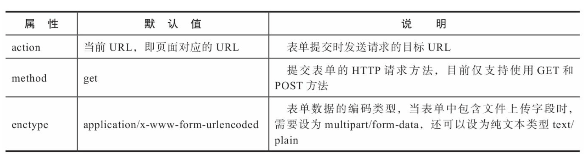
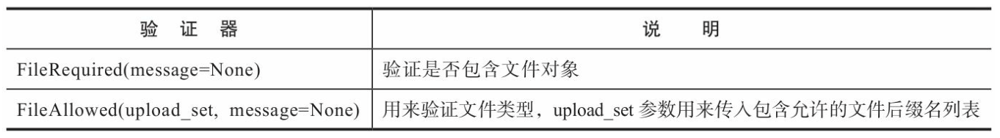

# 表单
## HTML表单
```html
<form method="post">
       <label for="username">Username</label><br>
       <input type="text" name="username" placeholder="Héctor Rivera"><br>
       <label for="password">Password</label><br>
       <input type="password" name="password" placeholder="19001130"><br>
       <input id="remember" name="remember" type="checkbox" checked>
       <label for="remember"><small>Remember me</small></label><br>
       <input type="submit" name="submit" value="Log in">
</form>
```
## 使用Flask-WTF处理表单
Flask-WTF将表单数据解析、CSRF保护、文件上传等功能与Flask集成，另外还附加了reCAPTCHA支持。  
Flask-WTF默认为每个表单启用CSRF保护，它会为我们自动生成和 验证CSRF令牌。
默认情况下，Flask-WTF使用程序密钥来对CSRF令牌进行签名，所以我们需要为程序设置密钥:
```python
app.secret_key = 'secret string'
```
### 定义WTForms表单类
当使用WTForms创建表单时，表单由Python类表示，这个类继承从WTForms导入的Form基类。
一个表单由若干个输入字段组成，这些字段分别用表单类的类属性来表示(字段即Field，你可以简单理解为表单内的输入框、按钮等部件)。
```python
from wtforms import Form, StringField, PasswordField, BooleanField, SubmitField
from wtforms.validators import DataRequired, Length
class LoginForm(Form):
    username = StringField('Username', validators=[DataRequired()])
    password = PasswordField('Password', validators=[DataRequired(), Length(8, 128)])
    remember = BooleanField('Remember me')
    submit = SubmitField('Log in')
```
alidators参数接收一个传入可调用对象组成的列表。内置的验证器 通过实现了__call__()方法的类表示，所以我们需要在验证器后添加括号。  
在name和password字段里，我们都使用了DataRequired验证器，用来验证输入的数据是否有效。
另外，password字段里还添加了一个Length验证器，用来验证输入的数据长度是否在给定的范围内。
验证器的第一个参数一般为错误提示消息，我们可以使用message关键字传递参数，通过传入自定义错误信息来覆盖内置消息。

### 输出HTML代码
以我们使用WTForms创建的LoginForm为例，实例化表单类，然后将实例属性转换成字符串或直接调用就可以获取表单字段对应的HTML代码:
```
>>> form = LoginForm()
>>> form.username()
u'<input id="username" name="username" type="text" value="">'
>>> form.submit()
u'<input id="submit" name="submit" type="submit" value="Submit">'
```
字段的<label>元素的HTML代码则可以通过“form.字段名.label”的形式获取:
```
>>> form.username.label()
u'<label for="username">Username</label>'
>>> form.submit.label()
u'<label for="submit">Submit</label>'
```

### 在模板中渲染表单
为了能够在模板中渲染表单，我们需要把表单类实例传入模板。
首先在视图函数里实例化表单类LoginForm，然后在render_template()函数中使用关键字参数form将表单实例传入模板。
```python
from forms import LoginForm
@app.route('/basic')
def basic():
   form = LoginForm()
   return render_template('login.html', form=form)
```
在模板中，只需要调用表单类的属性即可获取字段对应的HTML代码，如果需要传入参数，也可以添加括号。
```html
<form method="post">
    {{ form.csrf_token }} <!-- 渲染CSRF令牌隐藏字段 -->
    {{ form.username.label }}{{ form.username }}<br> 
    {{ form.password.label }}{{ form.password }}<br> 
    {{ form.remember }}{{ form.remember.label }}<br> 
    {{ form.submit }}<br>
</form>
```
需要注意的是，在上面的代码中，除了渲染各个字段的标签和字段本身，
我们还调用了form.csrf_token属性渲染Flask-WTF为表单类自动创建的CSRF令牌字段。
form.csrf_token字段包含了自动生成的CSRF令牌值，在提交表单后会自动被验证，为了确保表单通过验证，我们必须在表单中手动渲染这个字段。  

## 处理表单数据
表单数据的处理涉及很多内容，除去表单提交不说，从获取数据到保存数据大致会经历以下步骤:  
1)解析请求，获取表单数据。  
2)对数据进行必要的转换，比如将勾选框的值转换成Python的布尔值。  
3)验证数据是否符合要求，同时验证CSRF令牌。   
4)如果验证未通过则需要生成错误消息，并在模板中显示错误消息。  
5)如果通过验证，就把数据保存到数据库或做进一步处理。  
除非是简单的程序，否则手动处理不太现实，使用Flask-WTF和 WTForms可以极大地简化这些步骤。  

### 提交表单
在HTML中，当<form>标签声明的表单中类型为submit的提交字段被单击时，就会创建一个提交表单的HTTP请求，
请求中包含表单各个字段的数据。表单的提交行为主要由三个属性控制。

form标签的action属性用来指定表单被提交的目标URL，默认为当前URL，也就是渲染该模板的路由所在的URL。
如果你要把表单数据发送到其他URL，可以自定义这个属性值。  
出于安全的考虑，我们一般使用POST方法提交表单。
使用POST方法时，按照默认的编码类型，表单数据会被存储在请求主体中，比如:
```
   POST /basic HTTP/1.0
   ...
   Content-Type: application/x-www-form-urlencoded
   Content-Length: 30
   username=greyli&password=12345
```
Flask为路由设置默认监听的HTTP方法为GET。
为了支持接收表单提交发送的POST请求，我们必须在app.route()装饰器里使用methods关键字为路由指定HTTP方法。
```python
@app.route('/', methods=['GET', 'POST'])
def basic():
   form = LoginForm()
   return render_template('basic.html', form=form)
```
### 验证表单数据
#### 客户端验证和服务器端验证
客户端验证(client side validation)是指在客户端(比如Web浏览器)对用户的输入值进行验证。
比如，使用HTML5内置的验证属性即可实现基本的客户端验证(type、required、min、max、accept等)。
比如，下面的username字段添加了required标志:
```html
<input type="text" name="username" required>
```
如果用户没有输入内容而按下提交按钮，会弹出浏览器内置的错误提示。  
客户端方式可以实时动态提示用户输入是否正确，只有用户输入正确后才会将表单数据发送到服务器。
客户端验证可以增强用户体验，降低服务器负载。  

服务器端验证(server side validation)是指用户把输入的数据提交到服务器端，在服务器端对数据进行验证。
如果验证出错，就在返回的响应中加入错误信息。用户修改后再次提交表单，直到通过验证。
我们在Flask程序中使用WTForms实现的就是服务器端验证。  

#### WTForms验证机制
WTForms验证表单字段的方式是在实例化表单类时传入表单数据， 然后对表单实例调用validate()方法。
这会逐个对字段调用字段实例化时定义的验证器，返回表示验证结果的布尔值。
如果验证失败，就把错误消息存储到表单实例的errors属性对应的字典中，验证的过程如下所示:
```
>>> from wtforms import Form, StringField, PasswordField, BooleanField
>>> from wtforms.validators import DataRequired, Length
>>> class LoginForm(Form):
...     username = StringField('Username', validators=[DataRequired()])
...     password = PasswordField('Password', validators=[DataRequired()
, Length(8, 128)])
>>> form = LoginForm(username='', password='123') >>> form.data # 表单数据字典
{'username': '', 'password': '123'}
>>> form.validate()
False
>>> form.errors # 错误消息字典
{'username': [u'This field is required.'], 'password': [u'Field must be
at least 6 characters long.']}
>>> form2 = LoginForm(username='greyli', password='123456')
>>> form2.data
{'username': 'greyli', 'password': '123456'}
>>> form2.validate()
True
>>> form2.errors
{}
```
如果单纯使用WTForms，我们在实例化表单类时需要首先把request.form传入表单类，
而使用Flask- WTF时，表单类继承的FlaskForm基类默认会从request.form获取表单数据，所以不需要手动传入。  
使用POST方法提交的表单，其数据会被Flask解析为一个字典，可以通过请求对象的form属性获取(request.form);
使用GET方法提交的表单的数据同样会被解析为字典，不过要通过请求对象的args属性获取 (request.args)。  
#### 在视图函数中验证表单
首先是实例化表单，如果是GET请求，那么就渲染模板;如果是POST请求，就调用validate()方法验证表单数据。
```python
from flask import request
@app.route('/basic', methods=['GET', 'POST'])
def basic():
    form = LoginForm()  # GET + POST
    if request.method == 'POST' and form.validate():
        ... # 处理POST请求
    return render_template('forms/basic.html', form=form)
```
因为WTForms会自动对CSRF令牌字段进行验证，如果没有渲染该字段会导致验证出错，错误消息为“CSRF token is missing”。  
Flask-WTF提供的validate_on_submit()方法合并了这两个操作，因此上面的代码可以简化为:
```python
@app.route('/basic', methods=['GET', 'POST'])
def basic():
   form = LoginForm()
   if form.validate_on_submit():
       ...
   return render_template('basic.html', form=form)
```
如果form.validate_on_submit()返回True，则表示用户提交了表单，且表单通过验证，那么我们就可以在这个if语句内获取表单数据：
```python
from flask import Flask, render_template, redirect, url_for, flash
   ...
@app.route('/basic', methods=['GET', 'POST'])
def basic():
   form = LoginForm()
   if form.validate_on_submit():
       username = form.username.data
       flash('Welcome home, %s!' % username)
       return redirect(url_for('index'))
   return render_template('basic.html', form=form)
```
### 在模板中渲染错误消息
如果form.validate_on_submit()返回False，那么说明验证没有通过。
对于验证未通过的字段，WTForms会把错误消息添加到表单类的errors属性中，这是一个匹配作为表单字段的类属性到对应的错误消息列表的字典。
我们一般会直接通过字段名来获取对应字段的错误消息列 表，即“form.字段名.errors”。比如，form.name.errors返回name字段的错误消息列表。
我们可以在模板里使用for循环迭代错误消息列表:
```python
@app.route('/basic', methods=['GET', 'POST'])
def basic():
    form = LoginForm()
    if form.validate_on_submit():
        username = form.username.data
        flash('Welcome home, %s!' % username)
        return redirect(url_for('index'))
    return render_template('basic.html', form=form)
```
```html
<form method="post">
       {{ form.csrf_token }}
       {{ form.username.label }}<br>
       {{ form.username() }}<br>
       
           <small class="error">{{ message }}</small><br>
       
       {{ form.password.label }}<br>
       {{ form.password }}<br>
       
           <small class="error">{{ message }}</small><br>
       
       {{ form.remember }}{{ form.remember.label }}<br>
       {{ form.submit }}<br>
</form>
```

## 表单进阶实践
### 设置错误消息语言
设置内置错误消息语言为中文:
```python
from flask_wtf import FlaskForm
app = Flask(__name__)
app.config['WTF_I18N_ENABLED'] = False
class MyBaseForm(FlaskForm):
   class Meta:
       locales = ['zh']
class HelloForm(MyBaseForm):
   name = StringField('Name', validators=[DataRequired()])
   submit = SubmitField()
```
首先，我们需要将配置变量WTF_I18N_ENABLED设为False，这会 让Flask-WTF使用WTForms内置的错误消息翻译。
然后我们需要在自定义基类中定义Meta类，并在locales列表中加入简体中文的地区字符串。 
在创建表单时，继承这个MyBaseForm即可将错误消息语言设为中文，比如上面定义的HelloForm。
### 使用宏渲染表单
在模板中渲染表单时，我们有大量的工作要做:  
1. 调用字段属性，获取input定义。  
2. 调用对应的label属性，获取label定义。  
3. 渲染错误消息。  
为了避免为每一个字段重复这些代码，我们可以创建一个宏来渲染表单字段。  
```html

   {{ field.label }}<br>
   {{ field(**kwargs) }}<br>
   
       
           <small class="error">{{ error }}</small><br>
       
   

```
我们调用form_field()宏逐个渲染表单中的字段，只要把每一个类属性传入form_field()宏，即可完成渲染。
```html

...
<form method="post">
   {{ form.csrf_token }}
   {{ form_field(form.username)}}<br>
   {{ form_field(form.password) }}<br>
   ...
</form>
```
### 自定义验证器
#### 行内验证器
```python
from wtforms import IntegerField, SubmitField
from wtforms.validators import ValidationError
class FortyTwoForm(FlaskForm):
   answer = IntegerField('The Number')
   submit = SubmitField()
   def validate_answer(form, field):
       if field.data != 42:
           raise ValidationError('Must be 42.')
```
当表单类中包含以“validate_字段属性名”形式命名的方法时，在验证字段数据时会同时调用这个方法来验证对应的字段，
这也是为什么表单类的字段属性名不能以validate开头。
验证方法接收两个位置参数，依次为form和field，前者为表单类实例，后者是字段对象，我们可以通过field.data获取字段数据， 
这两个参数将在验证表单时被调用传入。验证出错时抛出从wtforms.validators模块导入的ValidationError异常，传入错误消息作为参数。
因为这种方法仅用来验证特定的表单类字段，所以又 称为行内验证器(in-line validator)。
#### 全局验证器
```python
from wtforms.validators import ValidationError
def is_42(form, field):
   if field.data != 42:
       raise ValidationError('Must be 42')
class FortyTwoForm(FlaskForm):
   answer = IntegerField('The Number', validators=[is_42])
   submit = SubmitField()
```
当使用函数定义全局的验证器时，我们需要在定义字段时在validators列表里传入这个验证器。
因为在validators列表中传入的验证器必须是可调用对象，所以这里传入了函数对象，而不是函数调用。

### 文件上传
在HTML中，渲染一个文件上传字段只需要将<input>标签的type属性设为file，即<input type="file">。
这会在浏览器中渲染成一个文件上传字段，单击文件选择按钮会打开文件选择窗口，选择对应的文件后，被选择的文件名会显示在文件选择按钮旁边。  
在服务器端，可以和普通数据一样获取上传文件数据并保存。不过我们需要考虑安全问题，文件上传漏洞也是比较流行的攻击方式。
除了常规的CSRF防范，我们还需要重点注意下面的问题:
 - 验证文件类型。 
 - 验证文件大小。 
 - 过滤文件名。
#### 定义上传表单
在Python表单类中创建文件上传字段时，我们使用扩展Flask-WTF提供的FileField类，
它继承WTForms提供的上传字段FileField，添加了对Flask的集成。
```python
# upload form
class UploadForm(FlaskForm):
    photo = FileField('Upload Image', validators=[FileRequired(), FileAllowed(['jpg', 'jpeg', 'png', 'gif'])])
    submit = SubmitField()
```

#### 渲染上传表单
在新创建的upload视图里，我们实例化表单类UploadForm，然后传入模板:
```python
@app.route('/upload', methods=['GET', 'POST'])
def upload():
    form = UploadForm()
    if form.validate_on_submit():
        f = form.photo.data
        filename = random_filename(f.filename)
        f.save(os.path.join(app.config['UPLOAD_PATH'], filename))
        flash('Upload success.')
        session['filenames'] = [filename]
        return redirect(url_for('show_images'))
    return render_template('upload.html', form=form)
```
在模板中渲染上传表单:
```html
<form method="post" enctype="multipart/form-data">
       {{ form.csrf_token }}
       {{ form_field(form.photo) }}
       {{ form.submit }}
</form>
```
当表单中包含文件上传字段时（即type属性为file的input标签），需要将表单的enctype属性设为"multipart/form-data"，
这会告诉浏览器将上传数据发送到服务器，否则仅会把文件名作为表单数据提交。  

#### 处理上传文件
和普通的表单数据不同，当包含上传文件字段的表单提交后，上传的文件需要在请求对象的files属性（request.files）中获取。
上传的文件会被Flask解析为Werkzeug中的FileStorage对象 (werkzeug.datastructures.FileStorage)。
当手动处理时，我们需要使用文件上传字段的name属性值作为键获取对应的文件对象。
```python
request.files.get('photo')
```
当使用Flask-WTF时，它会自动帮我们获取对应的文件对象，这里我们仍然使用表单类属性的data属性获取上传文件。
```python
@app.route('/upload', methods=['GET', 'POST'])
def upload():
    form = UploadForm()
    if form.validate_on_submit():
        f = form.photo.data
        filename = random_filename(f.filename)
        f.save(os.path.join(app.config['UPLOAD_PATH'], filename))
        flash('Upload success.')
        session['filenames'] = [filename]
        return redirect(url_for('show_images'))
    return render_template('upload.html', form=form)
```
当表单通过验证后，我们通过form.photo.data获取存储上传文件的 FileStorage对象。接下来，我们需要处理文件名，通常有三种处理方式:
1. 使用原文件名  
如果能够确定文件的来源安全，可以直接使用原文件名，通过FileStorage对象的filename属性获取:
```python
filename = f.filename
```
2. 使用过滤后的文件名  
如果要支持用户上传文件，我们必须对文件名进行处理，因为攻击 者可能会在文件名中加入恶意路径。  
我们可以使用Werkzeug提供的secure_filename()函数对文件名进行过滤，传递文件名作为参数，它会过滤掉所有危险字符，返回“安全的文件名”。
```
>>> from werkzeug import secure_filename
>>> secure_filename('avatar!@#//#\\%$^&.jpg') 'avatar.jpg'
>>> secure_filename('avatar头像.jpg') 'avatar.jpg'
```
3. 统一重命名  
secure_filename()函数，会过滤掉文件名中的非ASCII字符。但如果文件名完全由非ASCII字符组成，那么会得到一个空文件名，
为了避免出现这种情况，更好的做法是使用统一的处理方式对所有上传的文件重新命名。
随机文件名有很多种方式可以生成，下面是一个使用Python内置的uuid模块生成随机文件名的random_filename()函数:
```python
def random_filename(filename):
   ext = os.path.splitext(filename)[1]
   new_filename = uuid.uuid4().hex + ext
   return new_filename
```
文件保存后，我们希望能够显示上传后的图片。
为了让上传后的文件能够通过URL获取，我们还需要创建一个视图函数来返回上传后的文件，如下所示:
```python
@app.route('/uploads/<path:filename>')
def get_file(filename):
   return send_from_directory(app.config['UPLOAD_PATH'], filename)
```
在这个uploads视图中，我们使用Flask提供的send_from_directory()函数来获取文件，传入文件的路径和文件名作为参数。
在get_file视图的URL规则中，filename变量使用了path转换器以支持传入包含斜线的路径字符串。  

在upload视图里保存文件后，我们使用flash()发送一个提示，将文件名保存到session中，最后重定向到show_images视图。
show_images视图返回的uploaded.html模板中将从session获取文件名，渲染出上传后的图片。
```html



Home




<a href="{{ url_for('get_file', filename=filename) }}" target="_blank">
    
</a>



```

#### 多文件上传
在客户端，通过在文件上传字段(type=file)加入multiple属性，就可以开启多选:
```html
<input type="file" id="file" name="file" multiple>
```
创建表单类时，可以直接使用WTForms提供的MultipleFileField字段实现，添加一个DataRequired验证器来确保包含文件:
```python
from wtforms import MultipleFileField
class MultiUploadForm(FlaskForm):
   photo = MultipleFileField('Upload Image', validators={DataRequired()}
   submit = SubmitField()
```
表单提交时，在服务器端的程序中，对request.files属性调用getlist()方法并传入字段的name属性值会返回包含所有上传文件对象的列表。
在multi_upload视图中，我们迭代这个列表，然后逐一对文件进行处理。
```python
@app.route('/multi-upload', methods=['GET', 'POST'])
def multi_upload():
    form = MultiUploadForm()

    if request.method == 'POST':
        filenames = []

        # check csrf token
        try:
            validate_csrf(form.csrf_token.data)
        except ValidationError:
            flash('CSRF token error.')
            return redirect(url_for('multi_upload'))

        photos = request.files.getlist('photo')
        # check if user has selected files. If not, the browser
        # will submit an empty file part without filename
        if not photos[0].filename:
            flash('No selected file.')
            return redirect(url_for('multi_upload'))

        for f in photos:
            # check the file extension
            if f and allowed_file(f.filename):
                filename = random_filename(f.filename)
                f.save(os.path.join(
                    app.config['UPLOAD_PATH'], filename
                ))
                filenames.append(filename)
            else:
                flash('Invalid file type.')
                return redirect(url_for('multi_upload'))
        flash('Upload success.')
        session['filenames'] = filenames
        return redirect(url_for('show_images'))
    return render_template('upload.html', form=form)
```

### 单个表单多个提交按钮
在某些情况下，我们可能需要为一个表单添加多个提交按钮。
比如在创建文章的表单中添加发布新文章和保存草稿的按钮。
当用户提交表单时，我们需要在视图函数中根据按下的按钮来做出不同的处理。
```python
class NewPostForm(FlaskForm):
title = StringField('Title', validators=[DataRequired(), Length(1, 50)]) body = TextAreaField('Body', validators=[DataRequired()])
save = SubmitField('Save') # 保存按钮
publish = SubmitField('Publish') # 发布按钮
```
save表示保存草稿按钮，publish表示发布按钮，正文字段使用TextAreaField字段。  
当表单数据通过POST请求提交时，Flask会把表单数据解析到request.form字典。
如果表单中有两个提交字段，那么只有被单击的提交字段才会出现在这个字典中。
当我们对表单类实例或特定的字段属性调用data属性时，WTForms会对数据做进一步处理。
对于提交字段的值，它会将其转换为布尔值:被单击的提交字段的值将是True，未被单击的值则是False。
基于这个机制，我们可以通过提交按钮字段的值来判断当前被单击的按钮。
```python
@app.route('/two-submits', methods=['GET', 'POST'])
def two_submits():
    form = NewPostForm()
    if form.validate_on_submit():
        if form.save.data:
            # save it...
            flash('You click the "Save" button.')
        elif form.publish.data:
            # publish it...
            flash('You click the "Publish" button.')
        return redirect(url_for('index'))
    return render_template('2submit.html', form=form)
```

### 单个页面多个表单
#### 单视图处理
创建两个表单，并在模板中分别渲染并不是难事，但是当提交某个 表单时，我们就会遇到问题。Flask-WTF根据请求方法判断表单是否提交，
但并不判断是哪个表单被提交，所以我们需要手动判断。基于上一节介绍的内容，我们知道被单击的提交字段最终的data属性值是布尔值，即True或False。
而解析后的表单数据使用input字段的name属性值作为键匹配字段数据，也就是说，如果两个表单的提交字段名称都是 submit，
那么我们也无法判断是哪个表单的提交字段被单击。  

解决问题的第一步就是为两个表单的提交字段设置不同的名称:
```python
class SigninForm(FlaskForm):
    username = StringField('Username', validators=[DataRequired(), Length(1, 20)])
    password = PasswordField('Password', validators=[DataRequired(), Length(8, 128)])
    submit1 = SubmitField('Sign in')

class RegisterForm(FlaskForm):
    username = StringField('Username', validators=[DataRequired(), Length(1, 20)])
    email = StringField('Email', validators=[DataRequired(), Email(), Length(1, 254)])
    password = PasswordField('Password', validators=[DataRequired(), Length(8, 128)])
    submit2 = SubmitField('Register')
```
在视图函数中，我们分别实例化这两个表单，根据提交字段的值来区分被提交的表单:
```python
@app.route('/multi-form', methods=['GET', 'POST'])
def multi_form():
    signin_form = SigninForm()
    register_form = RegisterForm()

    if signin_form.submit1.data and signin_form.validate():
        username = signin_form.username.data
        flash('%s, you just submit the Signin Form.' % username)
        return redirect(url_for('index'))

    if register_form.submit2.data and register_form.validate():
        username = register_form.username.data
        flash('%s, you just submit the Register Form.' % username)
        return redirect(url_for('index'))

    return render_template('2form.html', signin_form=signin_form, register_form=register_form)
```
#### 多视图处理
在介绍表单处理时，我们在同一个视图函数内处理两类工作:渲染包含表单的模板(GET请求)、处理表单请求(POST请求)。
如果你想解耦这部分功能，那么也可以分离成两个视图函数处理。当处理多个表单时，我们可以把表单的渲染在单独的视图函数中处理。
```python
@app.route('/multi-form-multi-view')
def multi_form_multi_view():
    signin_form = SigninForm2()
    register_form = RegisterForm2()
    return render_template('2form2view.html', signin_form=signin_form, register_form=register_form)
```
这个视图只负责处理GET请求，实例化两个表单类并渲染模板。另外我们再为每一个表单单独创建一个视图函数来处理验证工作。
处理表单提交请求的视图仅监听POST请求
```python
@app.route('/handle-signin', methods=['POST'])
def handle_signin():
    signin_form = SigninForm2()
    register_form = RegisterForm2()

    if signin_form.validate_on_submit():
        username = signin_form.username.data
        flash('%s, you just submit the Signin Form.' % username)
        return redirect(url_for('index'))

    return render_template('2form2view.html', signin_form=signin_form, register_form=register_form)


@app.route('/handle-register', methods=['POST'])
def handle_register():
    signin_form = SigninForm2()
    register_form = RegisterForm2()

    if register_form.validate_on_submit():
        username = register_form.username.data
        flash('%s, you just submit the Register Form.' % username)
        return redirect(url_for('index'))
    return render_template('2form2view.html', signin_form=signin_form, register_form=register_form)
```
在HTML中，表单提交请求的目标URL通过action属性设置。为了让表单提交时将请求发送到对应的URL，我们需要设置action属性，如下所示:
```html
...
<h2>Login Form</h2>
<form method="post" action="{{ url_for('handle_signin') }}">
... 
</form>
<h2>Register Form</h2>
<form method="post" action="{{ url_for('handle_register') }}">
...
</form>
...
```