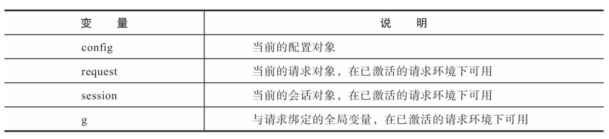
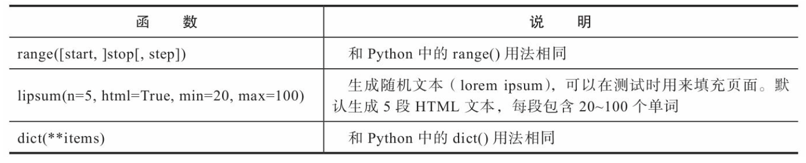
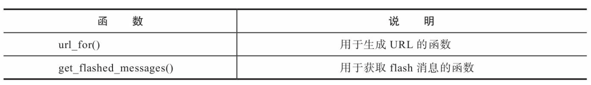
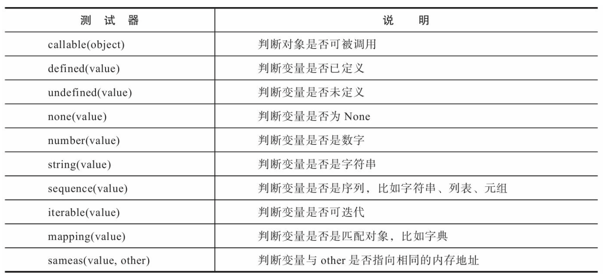

# 模版
当用户访问程序的根地址时，我们的视图函数会向客户端返回一行HTML代码。然而，一个完整的HTML页面往往需要几十 行甚至上百行代码，
如果都写到视图函数里，那可真是个噩梦。
这样的代码既不简洁也难于维护，正确的做法是把HTML代码存储在单独的文件中，以便让程序的业务逻辑和表现逻辑分离，即控制器和用户界面的分离。  

在动态Web程序中，视图函数返回的HTML数据往往需要根据相应的变量(比如查询参数)动态生成。
当HTML代码保存到单独的文件中时，我们没法再使用字符串格式化或拼接字符串的方式来在HTML代码中插入变量，
这时我们需要使用模板引擎(template engine)。借助模板引擎，我们可以在HTML文件中使用特殊的语法来标记出变量，
这类包含固定内容和动态部分的可重用文件称为模板(template)。  

模板引擎的作用就是读取并执行模板中的特殊语法标记，并根据传入的数据将变量替换为实际值，输出最终的HTML页面，
这个过程被称为渲染(rendering)。Flask默认使用的模板引擎是Jinja2，它是一个功能齐全的Python模板引擎，除了设置变量，
还允许我们在模板中添加if判断，执行for迭代，调用函数等，以各种方式控制模板的输出。
对于Jinja2来说，模板可以是任何格式的纯文本文件，比如HTML、XML、 CSV、LaTeX等。

## 模版的基本使用
### 创建模版
电影虚拟数据：
```python
   user = {
       'username': 'Grey Li',
       'bio': 'A boy who loves movies and music.',
}
   movies = [
       {'name': 'My Neighbor Totoro', 'year': '1988'},
       {'name': 'Three Colours trilogy', 'year': '1993'},
       {'name': 'Forrest Gump', 'year': '1994'},
       {'name': 'Perfect Blue', 'year': '1997'},
       {'name': 'The Matrix', 'year': '1999'},
       {'name': 'Memento', 'year': '2000'},
       {'name': 'The Bucket list', 'year': '2007'},
       {'name': 'Black Swan', 'year': '2010'},
       {'name': 'Gone Girl', 'year': '2014'},
       {'name': 'CoCo', 'year': '2017'},
]
```
watchlist.html模版文件：
```html
<!DOCTYPE html>
<html lang="en">
<head>
    <meta charset="utf-8">
    <title>{{ user.username }}'s Watchlist</title>
</head>
<body>
<a href="{{ url_for('index') }}">&larr; Return</a>
<h2>{{ user.username }}</h2>

    <i>{{ user.bio }}</i>

    <i>This user has not provided a bio.</i>

{# Below is the movie list (this is comment) #}
<h5>{{ user.username }}'s Watchlist ({{ movies|length }}):</h5>
<ul>
    
    <li>{{ movie.name }} - {{ movie.year }}</li>
    
</ul>
</body>
</html>
```
在模板中添加Python语句和表达式时，我们需要使用特定的定界符把它们标示出来。
1. 语句  
比如if判断、for循环等
```html

```
2. 表达式  
比如字符串、变量、函数调用等:
```html
{{ ... }}
```
3. 注释
```html
{# ... #}
```
另外，在模板中，Jinja2支持使用“.”获取变量的属性，比如user字典中的username键值通过“.”获取，即user.username，
在效果上等同于 user['username']。

### 渲染模板
渲染一个模板，就是执行模板中的代码，并传入所有在模板中使用的变量，渲染后的结果就是我们要返回给客户端的HTML响应。
在视图函数中渲染模板时，我们并不直接使用Jinja2提供的函数，而是使用Flask提供的渲染函数render_template()。
```python
from flask import Flask, render_template
...
@app.route('/watchlist')
def watchlist():
   return render_template('watchlist.html', user=user, movies=movies)
```
根据我们传入的虚拟数据，render_template()渲染后返回的HTML数据如下所示:
```html
 <!DOCTYPE html>
<html lang="en">
<head>
   <meta charset="utf-8">
   <title>Grey Li's Watchlist</title>
</head>
<body>
<a href="/">&larr; Return</a>
<h2>Grey Li</h2>
<i>A boy who loves movies and music.</i>
<h5>Grey Li's Watchlist (10):</h5>
<ul>
   <li>My Neighbor Totoro - 1988</li>
   <li>Three Colours trilogy - 1993</li>
   <li>Forrest Gump - 1994</li>
   <li>Perfect Blue - 1997</li>
   <li>The Matrix - 1999</li>
   <li>Memento - 2000</li>
   <li>The Bucket list - 2007</li>
   <li>Black Swan - 2010</li>
   <li>Gone Girl - 2014</li>
   <li>CoCo - 2017</li></ul>
</body>
</html>
```
## 模板辅助工具
### 上下文
模板上下文包含了很多变量，其中包括我们调用render_template()函数时手动传入的变量以及Flask默认传入的变量。 
除了渲染时传入变量，你也可以在模板中定义变量，使用set标签:
```html

```
你也可以将一部分模板数据定义为变量，使用set和endset标签声明开始和结束:
```html

       <li><a href="/">Home</a>
       <li><a href="/about">About</a>

```
#### 内置上下文变量
Flask在模板上下文中提供了一些内置变量，可以在模板中直接使用:

#### 自定义上下文
如果多个模板都需要使用同一变量，那么比起在多个视图函数中重复传入，更好的方法是能够设置一个模板全局变量。
Flask提供了一个 app.context_processor装饰器，可以用来注册模板上下文处理函数，它可以帮我们完成统一传入变量的工作。
模板上下文处理函数需要返回一个包含变量键值对的字典，如代码清单3-3所示。
```python
@app.context_processor
def inject_foo():
    foo = 'I am foo.'
    return dict(foo=foo) # 等同于return {'foo': foo}
```
当我们调用render_template()函数渲染任意一个模板时，
所有使用app.context_processor装饰器注册的模板上下文处理函数(包括Flask内置的上下文处理函数)都会被执行，
这些函数的返回值会被添加到模板中，因此我们可以在模板中直接使用foo变量。

### 全局对象
全局对象是指在所有的模板中都可以直接使用的对象，包括在模板中导入的模板。
#### 内置全局函数
Jinja2在模板中默认提供了一些全局函数，常用的三个函数：

除了Jinja2内置的全局函数，Flask也在模板中内置了两个全局函数：

#### 自定义全局函数
除了使用app.context_processor注册模板上下文处理函数来传入函数，
我们也可以使用app.template_global装饰器直接将函数注册为模板全局函数。
```python
@app.template_global()
def bar():
   return 'I am bar.'
```
默认使用函数的原名称传入模板，在app.template_global()装饰器中使用name参数可以指定一个自定义名称。
### 过滤器
在Jinja2中，过滤器(filter)是一些可以用来修改和过滤变量值的特殊函数，过滤器和变量用一个竖线(管道符号)隔开，
需要参数的过滤器可以像函数一样使用括号传递。  
在示例模板watchlist.html中使用length获取movies列表的长度，类似于在Python中调用 len(movies):
```html
{{ movies|length }}
```
另一种用法是将过滤器作用于一部分模板数据，使用filter标签和endfilter标签声明开始和结束。
比如，下面使用upper过滤器将一段文字转换为大写:
```html

   This text becomes uppercase.

```
#### 内置过滤器
Jinja2提供了许多内置过滤器:  
http://jinja.pocoo.org/docs/2.10/templates/#builtin-filters  

#### 自定义过滤器
使用app.template_filter()装饰器可以注册自定义过滤器。
```python
from flask import Markup
@app.template_filter()
def musical(s):
   return s + Markup(' &#9835;')
```
和注册全局函数类似，你可以在app.template_filter()中使用name关键字设置过滤器的名称，默认会使用函数名称。

### 测试器
在Jinja2中，测试器(Test)是一些用来测试变量或表达式，返回布尔值(True或False)的特殊函数。
比如，number测试器用来判断一个变量或表达式是否是数字，我们使用is连接变量和测试器:
```html

    {{ age * 365 }} 
   
    无效的数字。

```
#### 内置测试器
Jinja2内置了许多测试器:

在使用测试器时，is的左侧是测试器函数的第一个参数(value)， 其他参数可以添加括号传入，也可以在右侧使用空格连接，以sameas为例:
```html
...
```
等同于：
```html
...
```
#### 自定义测试器
和过滤器类似，我们可以使用Flask提供的app.template_test()装饰 器来注册一个自定义测试器。
```python
@app.template_test()
def baz(n):
   if n == 'baz':
       return True
   return False
```
测试器的名称默认为函数名称，你可以在app.template_test()中使 用name关键字指定自定义名称。
测试器函数需要接收被测试的值作为输入，返回布尔值。

### 模板环境对象
在Jinja2中，渲染行为由jinja2.Enviroment类控制，所有的配置选项、上下文变量、全局函数、过滤器和测试器都存储在Enviroment实例上。
当与Flask结合后，我们并不单独创建Enviroment对象，而是使用Flask创建的Enviroment对象，它存储在app.jinja_env属性上。
#### 添加自定义全局对象
```python
def bar():
    return 'I am bar.'
foo = 'I am foo.'

app.jinja_env.globals['bar'] = bar
app.jinja_env.globals['foo'] = foo
```
#### 添加自定义过滤器
```python
def smiling(s):
   return s + ' :)'
         
app.jinja_env.filters['smiling'] = smiling
```
#### 添加自定义测试器
使用app.jinja_env.tests向模板中添加自定义测试器baz:
```python
def baz(n):
   if n == 'baz':
       return True
   return False

app.jinja_env.tests['baz'] = baz
```
## 模板结构组织
### 局部模板
当多个独立模板中都会使用同一块HTML代码时，我们可以把这部分代码抽离出来，存储到局部模板中。
这样一方面可以避免重复，另一方面也可以方便统一管理。
比如，多个页面中都要在页面顶部显示一个提示条，这个横幅可以定义在局部模板_banner.html中。  
我们使用include标签来插入一个局部模板，这会把局部模板的全部内容插在使用include标签的位置。
比如，在其他模板中，我们可以在任意位置使用下面的代码插入_banner.html的内容:
```html

```
为了和普通模板区分开，局部模板的命名通常以一个下划线开始。

### 宏
宏(macro)是Jinja2提供的一个非常有用的特性，它类似Python中的函数。
使用宏可以把一部分模板代码封装到宏里，使用传递的参数来构建内容，最后返回构建后的内容。
在功能上，它和局部模板类似，都是为了方便代码块的重用。
为了便于管理，我们可以把宏存储在单独的文件中，这个文件通常命名为macros.html或_macors.html。
在创建宏时，我们使用macro和endmacro标签声明宏的开始和结束。在开始标签中定义宏的名称和接收的参数，下面是一个简单的示例:
```html

   
       I am qux.
   
       We are quxs.
   

```
使用时，需要像从Python模块中导入函数一样使用import语句导入它，然后作为函数调用，传入必要的参数，如下所示:
```html

...
{{ qux(amount=5) }}
```
